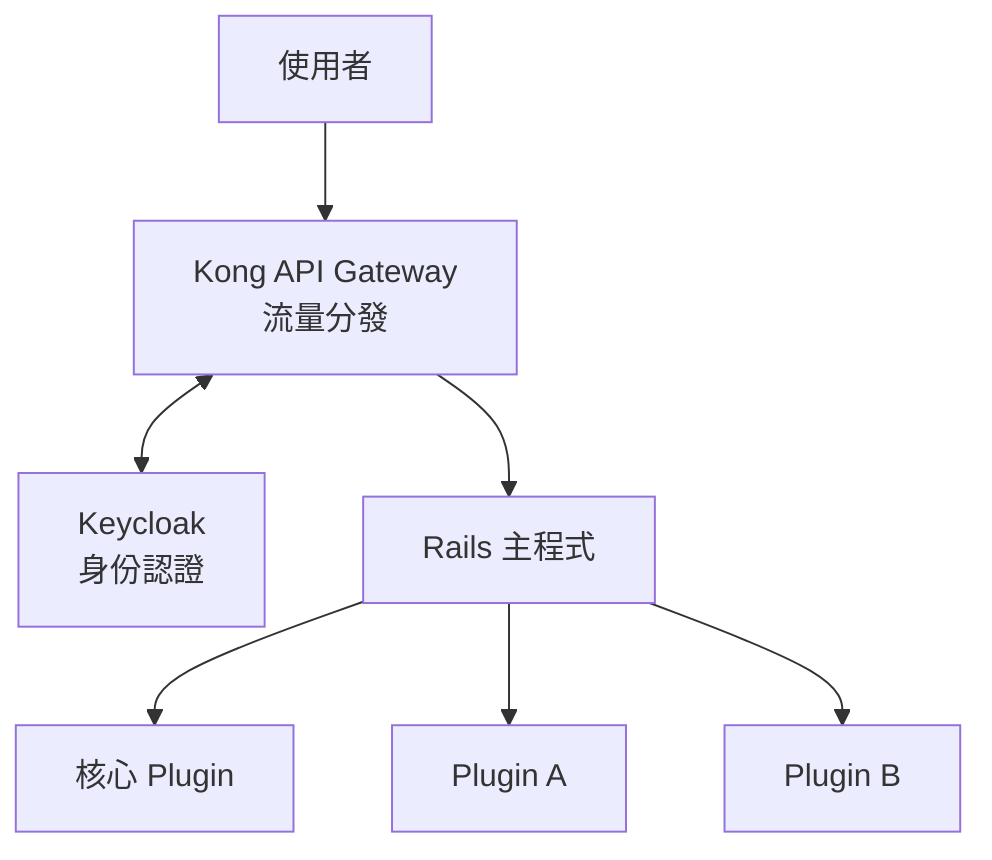

# h8 專案

開放式 Rails Plugin 生態系架構設計。

---

## 概述

h8 是一個**大型應用生態系**專案，目標是建立類似 Redmine / WordPress 的 Plugin 架構，讓各廠商可以基於統一框架開發應用模組。

### 核心理念

| 理念 | 說明 |
|-----|------|
| 統一入口 | 所有認證、權限由主程式管控 |
| 模組化設計 | 功能以 Plugin 形式開發，可插拔 |

---

## 系統架構



---

## Plugin 類型

| 類型 | 開發者 | 可否移除 | 說明 |
|-----|-------|---------|------|
| 核心 Plugin (Core) | 平台方 | ❌ | 認證、權限、DAL |
| 業務 Plugin | 各廠商 | ✅ | 實際業務功能 |

---

## 管控策略

| 策略 | 說明 |
|-----|------|
| 行政嚴格 | 規範 + Code Review + 上架審核 |
| 技術引導 | 提供 DAL API，讓「做對的事比較容易」 |

---

## 文件目錄

| 文件 | 說明 |
|-----|------|
| [spec.md](docs/spec.md) | 專案規格書 — 系統架構、元件說明、技術選型 |
| [naming-conventions.md](docs/naming-conventions.md) | 命名規範 |
| [core-plugin-guide.md](docs/core-plugin/core-plugin-guide.md) | 核心 Plugin 開發指南 |
| [auth.md](docs/core-plugin/auth/auth.md) | 認證機制設計 — 身份驗證、Token 管理 |
| [permissions.md](docs/core-plugin/permissions/permissions.md) | 權限機制設計 — 分層權限、細粒度資源控制 |
| [data.md](docs/core-plugin/data/data.md) | 資料存取層設計 — DAL 架構、Plugin 間資料隔離 |
| [logging.md](docs/core-plugin/logging/logging.md) | Logging 模組設計 — 日誌格式、追蹤、稽核 |
| [configuration.md](docs/core-plugin/configuration/configuration.md) | 配置管理設計 — 分層設定、Plugin 註冊、動態更新 |
| [caching.md](docs/core-plugin/caching/caching.md) | 快取機制 — Plugin 隔離、失效策略、Redis 整合 |
| [event-bus.md](docs/core-plugin/event-bus/event-bus.md) | 事件匯流排 — Pub/Sub 機制、模組解耦 |
| [writing-guide.md](docs/writing-guide.md) | 文件撰寫指南 |

---

## 目錄結構

```
h8/
├── README.md
├── docs/
│   ├── spec.md
│   ├── naming-conventions.md
│   ├── writing-guide.md
│   └── core-plugin/
│       ├── core-plugin-guide.md
│       ├── auth/
│       │   └── auth.md
│       ├── data/
│       │   └── data.md
│       └── permissions/
│           └── permissions.md
├── code/
└── tmp/
```

---

## 待辦事項 (Roadmap)

### 已完成 (Done)
- [x] **Spec** — [專案規格書](docs/spec.md)
- [x] **Auth** — [認證機制](docs/core-plugin/auth/auth.md)
- [x] **Permission** — [權限管理](docs/core-plugin/permissions/permissions.md)
- [x] **DAL** — [資料存取層](docs/core-plugin/data/data.md)
- [x] **Writing Guide** — [文件撰寫指南](docs/writing-guide.md)
- [x] **Infrastructure**
    - [x] [Logging](docs/core-plugin/logging/logging.md) — 日誌記錄
    - [x] [Configuration](docs/core-plugin/configuration/configuration.md) — 配置管理
    - [x] [Caching](docs/core-plugin/caching/caching.md) — 快取機制
    - [x] [Event/Message Bus](docs/core-plugin/event-bus/event-bus.md) — 事件匯流排

### 進行中 (In Progress)
- [ ] **Core Plugin Guide** — [核心 Plugin 開發指南](docs/core-plugin/core-plugin-guide.md) (Draft)

### 待撰寫文件 (Documentation Queue)

#### P0: 核心開發規範
- [ ] `plugin-dev-guide.md` (Plugin 開發指南)
  - 目錄結構、命名規範、Engine 設定、角色宣告、Policy 撰寫、DAL 使用
- [ ] `plugin-lifecycle.md` (Plugin 上架流程)
  - 註冊流程、審核標準、版本管理、下架機制

#### P1: 技術規格
- [ ] `api-spec.md` (API 規範)
  - RESTful 設計、錯誤碼、分頁、Header 格式
- [ ] `database-spec.md` (資料庫規範)
  - Table 命名、Migration 規範、Index 指南

#### P2: 進階架構
- [ ] `frontend-spec.md` (前端架構規範)
  - Hotwire、UI 元件、樣式指南
- [ ] `deployment.md` (部署架構)
  - Docker、Kamal、環境變數
- [ ] `testing-guide.md` (測試策略)

### 功能模組規劃 (Feature Backlog)
- [ ] **Validation** — 資料驗證
- [ ] **Error Handling** — 全域錯誤處理
- [ ] **Localization (i18n)** — 多語系
- [ ] **Job Scheduler** — 排程
- [ ] **Notification** — 通知服務
- [ ] **Audit Trail** — 稽核日誌
- [ ] **Rate Limiting** — 流量限制
- [ ] **Health Check** — 健康檢查

---

## 狀態

🚧 **規劃階段** — 目前專注於架構設計與文件撰寫

