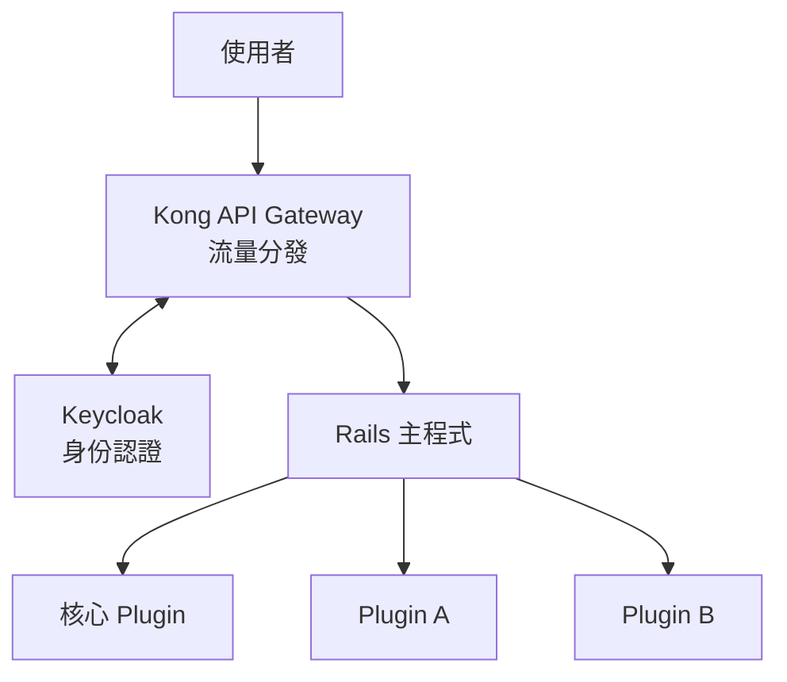

# h8 專案

開放式 Rails Plugin 生態系架構設計。

---

## 概述

h8 是一個**大型應用生態系**專案，目標是建立類似 Redmine / WordPress 的 Plugin 架構，讓各廠商可以基於統一框架開發應用模組。

### 核心理念

| 理念 | 說明 |
|-----|------|
| 統一入口 | 所有認證、權限由主程式管控 |
| 模組化設計 | 功能以 Plugin 形式開發，可插拔 |

---

## 系統架構



---

## Plugin 類型

| 類型 | 開發者 | 可否移除 | 說明 |
|-----|-------|---------|------|
| 核心 Plugin (Core) | 平台方 | ❌ | 認證、權限、DAL |
| 業務 Plugin | 各廠商 | ✅ | 實際業務功能 |

---

## 管控策略

| 策略 | 說明 |
|-----|------|
| 行政嚴格 | 規範 + Code Review + 上架審核 |
| 技術引導 | 提供 DAL API，讓「做對的事比較容易」 |

---

## 文件目錄

| 文件 | 說明 |
|-----|------|
| [spec.md](docs/spec.md) | 專案規格書 — 系統架構、元件說明、技術選型 |
| [naming-conventions.md](docs/naming-conventions.md) | 命名規範 |
| [core-plugin-guide.md](docs/core-plugin/core-plugin-guide.md) | 核心 Plugin 開發指南 |
| [auth/README.md](docs/core-plugin/auth/README.md) | 認證機制設計 — 身份驗證、Token 管理 |
| [permissions.md](docs/core-plugin/permissions/permissions.md) | 權限機制設計 — 分層權限、細粒度資源控制 |
| [data.md](docs/core-plugin/data/data.md) | 資料存取層設計 — DAL 架構、Plugin 間資料隔離 |
| [logging.md](docs/core-plugin/logging/logging.md) | Logging 模組設計 — 日誌格式、追蹤、稽核 |
| [configuration.md](docs/core-plugin/configuration/configuration.md) | 配置管理設計 — 分層設定、Plugin 註冊、動態更新 |
| [caching.md](docs/core-plugin/caching/caching.md) | 快取機制 — Plugin 隔離、失效策略、Redis 整合 |
| [writing-guide.md](docs/writing-guide.md) | 文件撰寫指南 |
| [checklist.md](docs/checklist.md) | 文件完成度檢查表（含閱讀順序） |

---

## 目錄結構

```
h8/
├── README.md
├── docs/
│   ├── spec.md
│   ├── naming-conventions.md
│   ├── writing-guide.md
│   ├── checklist.md
│   └── core-plugin/
│       ├── core-plugin-guide.md
│       ├── auth/
│       │   └── README.md
│       ├── data/
│       │   └── data.md
│       └── permissions/
│           └── permissions.md
├── code/
└── tmp/
```

---

## TODO - 核心模組規劃

### 已完成
- [x] AUTH — 認證機制
- [x] Permission — 權限管理
- [x] DAL — 資料存取層

### 基礎設施層
- [x] Logging — 日誌記錄（設計完成，依賴 Configuration）
- [x] **Configuration** — 配置管理，環境變數、設定檔讀取
- [x] **Caching** — 快取機制，提升效能、減少資料庫壓力
- [ ] Event/Message Bus — 事件匯流排，模組間解耦通訊 ⬅️ 下一步


#### Configuration 需支援的設定項（已知）

| 來源模組 | 設定項 | 說明 |
|---------|-------|------|
| Logging | `logging.retention.<type>` | 各類型日誌保留期限 |
| Logging | `logging.level` | 日誌層級 (debug/info/warn/error) |
| Logging | `logging.format` | 輸出格式 (json/text) |

### 應用服務層
- [ ] Validation — 資料驗證，輸入檢查、業務規則驗證
- [ ] Error Handling — 錯誤處理，統一例外處理、錯誤回應格式
- [ ] Localization (i18n) — 多語系支援，國際化翻譯
- [ ] Job Scheduler — 排程任務，定時執行背景工作
- [ ] Notification — 通知服務，Email、SMS、推播等

### 安全與監控
- [ ] Audit Trail — 稽核日誌，記錄使用者操作歷程
- [ ] Rate Limiting — 流量限制，防止濫用
- [ ] Health Check — 健康檢查，服務狀態監控

### 開發輔助
- [ ] Dependency Injection (DI) — 依賴注入容器
- [ ] Middleware Pipeline — 中介軟體管線
- [ ] File Storage — 檔案儲存抽象層

### 專案建置
- [ ] Plugin 註冊與發布流程
- [ ] 開發環境建置指南
- [ ] CI/CD 流程

---

## 狀態

🚧 **規劃階段** — 目前專注於架構設計與文件撰寫
