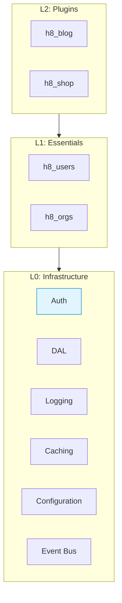
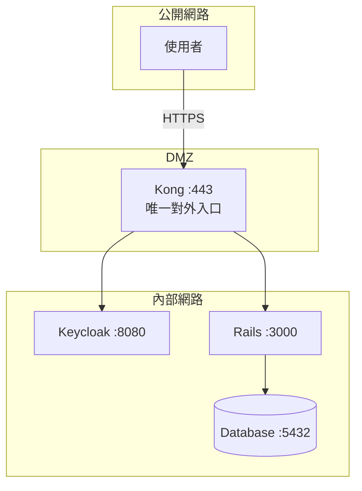
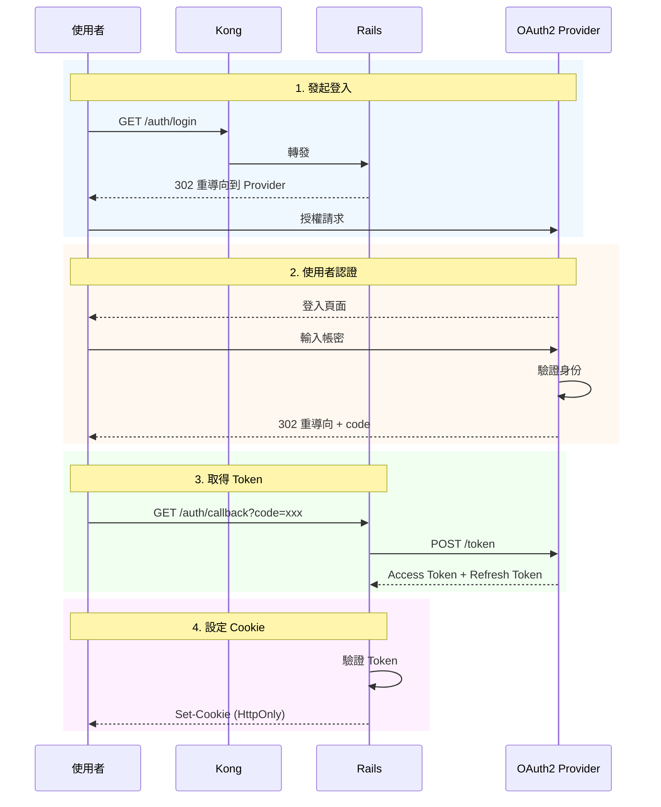
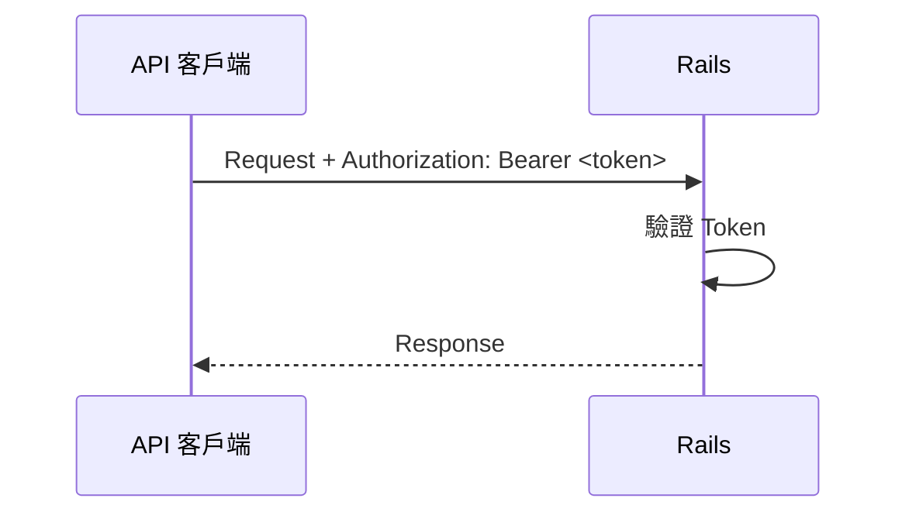
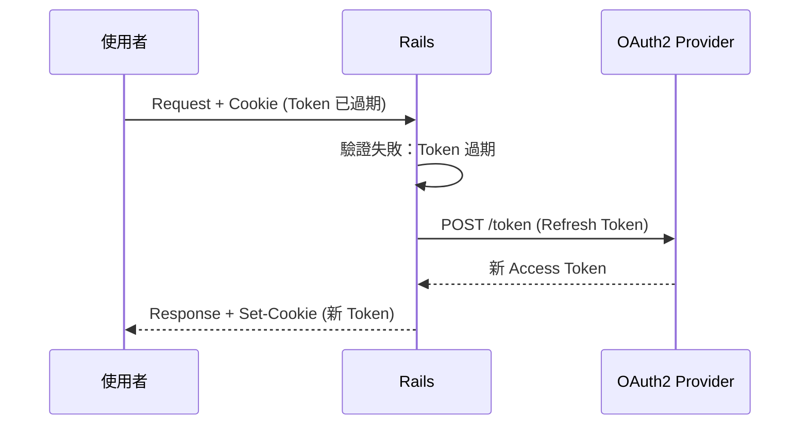
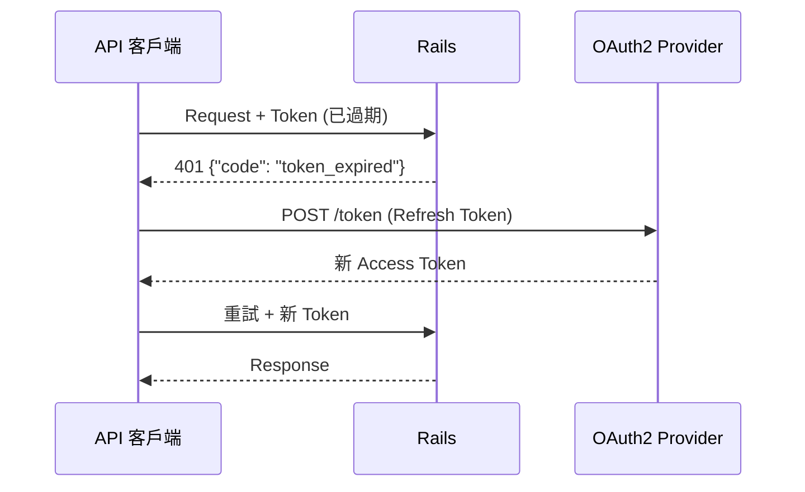
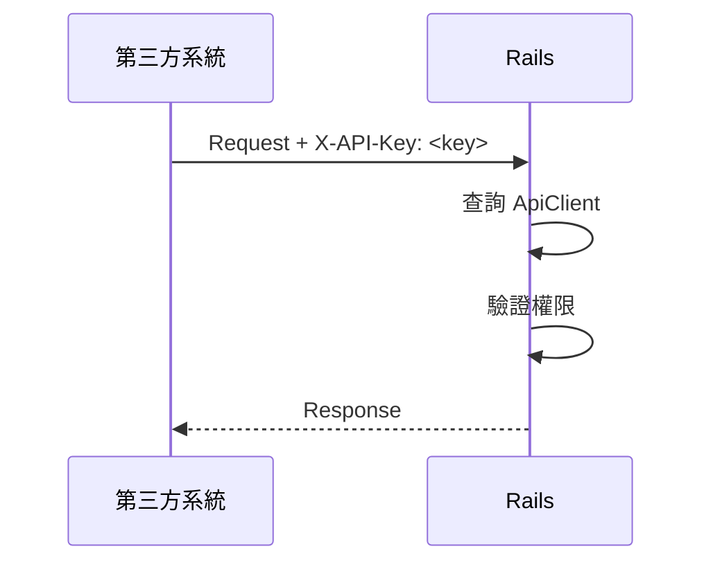
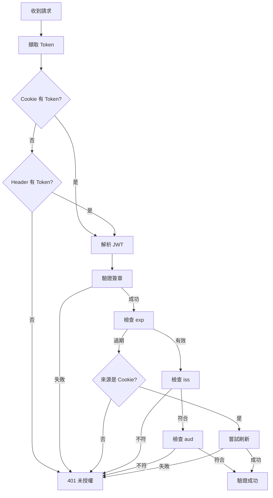
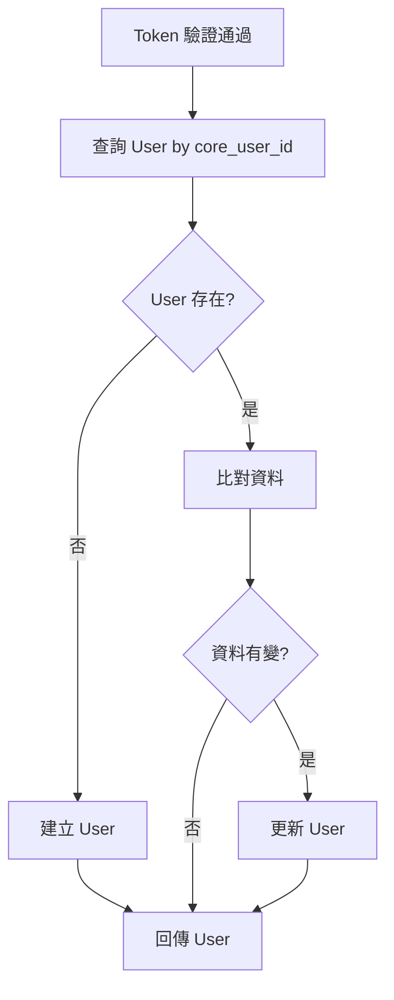

# 認證模組規格

> 版本：1.0  
> 更新日期：2026-01-20

---

## 概述

認證模組是核心 Plugin 的第一層，負責驗證請求者身份。

### 支援的認證模式

| 模式 | 用途 | 識別結果 |
|------|------|---------|
| JWT Token | 使用者操作 | `core_current_user` |
| API Key | 系統對系統 | `core_api_client` |
| 無認證 | 公開資源 | 無 |

### 相關標準

- RFC 7519 - JSON Web Token (JWT)
- RFC 7515 - JSON Web Signature (JWS)
- RFC 7517 - JSON Web Key (JWK)
- RFC 6749 - OAuth 2.0 Authorization Framework

---

## 架構定位

認證模組屬於 **L0: Infrastructure（基礎設施層）**，是 `h8_core` 的一部分。



| 層級 | 說明 |
|:---:|:-----|
| **L0** | Auth 模組位於此層，統一管控所有身份驗證 |
| **L1** | Essentials Plugin 依賴 Auth 進行使用者身份識別 |
| **L2** | 業務 Plugin 透過 `core_current_user` 取得已驗證的使用者 |

---

## 系統架構

### 網路架構



### 元件職責

| 元件 | 職責 |
|------|------|
| Kong | 路由分發、SSL 終止、流量控制 |
| OAuth2 Provider | 身份驗證、發放 Token |
| Rails | 驗證 Token、角色權限、業務邏輯 |

### Kong 路由規則

| 路徑 | 目標 |
|------|------|
| `/auth/*` | OAuth2 Provider |
| `/*` | Rails |

---

## JWT Token 規格

### Token 結構

```
<Header>.<Payload>.<Signature>
```

採用 Base64URL 編碼，符合 RFC 7519。

### Header

```json
{
  "alg": "RS256",
  "typ": "JWT"
}
```

| 欄位 | 值 | 說明 |
|------|-----|------|
| `alg` | `RS256` | 簽章演算法（必要） |
| `typ` | `JWT` | Token 類型 |

### Payload

```json
{
  "sub": "550e8400-e29b-41d4-a716-446655440000",
  "exp": 1737417600,
  "iat": 1737414000,
  "iss": "https://auth.example.com/realms/h8",
  "aud": "h8-rails-app",
  "email": "user@example.com",
  "name": "王小明"
}
```

| 欄位 | 必要 | 說明 |
|------|------|------|
| `sub` | ✅ | 使用者唯一識別碼 |
| `exp` | ✅ | 過期時間（Unix timestamp） |
| `iat` | ✅ | 發行時間（Unix timestamp） |
| `iss` | ✅ | 發行者 URL |
| `aud` | ✅ | 受眾（應用程式識別碼） |
| `email` | - | 使用者 Email |
| `name` | - | 使用者名稱 |

### 簽章驗證

```
Signature = RS256(
  Base64URL(Header) + "." + Base64URL(Payload),
  PrivateKey
)
```

驗證時使用 JWKS Endpoint 取得公鑰。

### Token 有效期

| Token 類型 | 有效期 |
|-----------|--------|
| Access Token | 30 分鐘 |
| Refresh Token | 7 天 |

---

## 認證流程

### JWT Token 認證（Web）



### JWT Token 認證（API）



### Token 刷新流程（Web）



### Token 刷新流程（API）



### API Key 認證



---

## Token 驗證規格

### 驗證流程



### JWKS 快取策略

| 條件 | 動作 |
|------|------|
| 快取為空 | 請求 JWKS Endpoint |
| 快取存在 | 使用快取 |
| 驗證失敗 | 清除快取，重試一次 |
| 快取超過 1 小時 | 背景更新 |

### Token 擷取器

```ruby
module CorePlugin::Auth::TokenExtractor
  def extract_token
    extract_from_cookie || extract_from_header
  end

  private

  def extract_from_cookie
    cookies.signed[:access_token]
  end

  def extract_from_header
    header = request.headers['Authorization']
    header&.match(/^Bearer\s+(.+)$/)&.captures&.first
  end
end
```

---

## User 同步機制

### 同步策略

**首次同步 + 按需更新**



### User Model

```ruby
class User < ApplicationRecord
  # === 核心欄位（必要）===
  attribute :core_user_id, :string      # Provider 識別碼
  attribute :core_provider, :string     # Provider 名稱
  attribute :core_status, :string       # active, locked, disabled
  attribute :core_last_login_at, :datetime

  # === 同步欄位（從 Token）===
  attribute :email, :string
  attribute :name, :string

  # === 驗證 ===
  validates :core_user_id, presence: true, uniqueness: true
  validates :email, presence: true

  # === 狀態 ===
  enum :core_status, {
    active: 'active',
    locked: 'locked',
    disabled: 'disabled'
  }, default: :active
end
```

### Migration

```ruby
class CreateUsers < ActiveRecord::Migration[7.1]
  def change
    create_table :users do |t|
      t.string :core_user_id, null: false
      t.string :core_provider
      t.string :core_status, default: 'active'
      t.datetime :core_last_login_at

      t.string :email, null: false
      t.string :name

      t.timestamps

      t.index :core_user_id, unique: true
      t.index :email
    end
  end
end
```

### 資料來源

| 欄位 | Source of Truth |
|------|-----------------|
| `core_user_id` | OAuth2 Provider |
| `email` | OAuth2 Provider → 同步 |
| `name` | OAuth2 Provider → 同步 |
| `core_status` | Rails |
| 角色 | Rails (Rolify) |

---

## API Key 認證

### ApiClient Model

```ruby
class ApiClient < ApplicationRecord
  attribute :name, :string
  attribute :key_digest, :string
  attribute :active, :boolean, default: true
  attribute :permissions, :json
  attribute :rate_limit, :integer, default: 60
  attribute :last_used_at, :datetime

  belongs_to :owner, polymorphic: true, optional: true

  validates :name, presence: true
  validates :key_digest, presence: true, uniqueness: true

  def self.authenticate(key)
    return nil if key.blank?
    find_by(key_digest: Digest::SHA256.hexdigest(key), active: true)
  end

  def can?(action, resource)
    permissions&.dig(resource.to_s)&.include?(action.to_s)
  end
end
```

### Migration

```ruby
class CreateApiClients < ActiveRecord::Migration[7.1]
  def change
    create_table :api_clients do |t|
      t.string :name, null: false
      t.string :key_digest, null: false
      t.boolean :active, default: true
      t.json :permissions
      t.integer :rate_limit, default: 60
      t.datetime :last_used_at
      t.references :owner, polymorphic: true

      t.timestamps

      t.index :key_digest, unique: true
    end
  end
end
```

### API Key 格式

```
h8_<base62_random_32_chars>
```

範例：`h8_Kj2mN8pQ4rS6tV0wX3yZ5aB7cD9eF1`

### 權限結構

```json
{
  "orders": ["read", "write"],
  "products": ["read"],
  "webhooks": ["receive"]
}
```

---

## Plugin 介面

### 認證 Helper

```ruby
module CorePlugin::Auth::CurrentUserHelper
  # 使用者識別碼（不查 DB）
  def core_user_id
    @token_payload&.dig('sub')
  end

  # 使用者物件（查 DB）
  def core_current_user
    return nil unless core_user_id
    @core_current_user ||= UserSynchronizer.sync(@token_payload)
  end

  # 是否已登入
  def core_user_signed_in?
    core_user_id.present?
  end

  # Token 原始內容
  def core_token_payload
    @token_payload
  end
end
```

### API Key Helper

```ruby
module CorePlugin::Auth::ApiKeyHelper
  def authenticate_api_key!
    key = request.headers['X-API-Key'] || params[:api_key]
    @api_client = ApiClient.authenticate(key)
    render_unauthorized('Invalid API Key') unless @api_client
  end

  def core_api_client
    @api_client
  end
end
```

### 認證控制

```ruby
module CorePlugin::Auth::Authenticatable
  extend ActiveSupport::Concern

  included do
    before_action :authenticate!
  end

  class_methods do
    def skip_authentication(**options)
      skip_before_action :authenticate!, **options
    end
  end
end
```

### 使用範例

```ruby
# 標準 JWT 認證（預設）
class OrdersController < ApplicationController
  def index
    @orders = Order.where(user: core_current_user)
  end
end

# API Key 認證
class WebhooksController < ApplicationController
  skip_authentication
  before_action :authenticate_api_key!

  def receive
    return render_forbidden unless core_api_client.can?('receive', 'webhooks')
    # 處理 webhook
  end
end

# 公開存取
class DocsController < ApplicationController
  skip_authentication

  def index
    # 公開文件
  end
end
```

---

## 錯誤處理

### 錯誤代碼

| Code | HTTP | 說明 |
|------|------|------|
| `token_missing` | 401 | 未提供 Token |
| `token_expired` | 401 | Token 已過期 |
| `token_invalid` | 401 | Token 無效 |
| `api_key_missing` | 401 | 未提供 API Key |
| `api_key_invalid` | 401 | API Key 無效 |
| `user_locked` | 403 | 使用者已鎖定 |
| `user_disabled` | 403 | 使用者已停用 |
| `access_denied` | 403 | 權限不足 |

### 錯誤回應格式

```json
{
  "error": "錯誤描述",
  "code": "error_code"
}
```

### Web 錯誤處理

| 錯誤 | 處理 |
|------|------|
| Token 過期 | 自動刷新 |
| 刷新失敗 | 重導向登入頁 |
| Token 無效 | 重導向登入頁 |

---

## 設定檔

### OAuth2 設定

```yaml
# config/oauth2.yml
default: &default
  client_id: <%= ENV['OAUTH2_CLIENT_ID'] %>
  client_secret: <%= ENV['OAUTH2_CLIENT_SECRET'] %>
  redirect_uri: <%= ENV['OAUTH2_REDIRECT_URI'] %>
  audience: <%= ENV.fetch('OAUTH2_AUDIENCE', 'h8-rails-app') %>

development:
  <<: *default
  issuer: "http://localhost:8080/realms/h8"
  jwks_uri: "http://localhost:8080/realms/h8/protocol/openid-connect/certs"
  authorize_endpoint: "http://localhost:8080/realms/h8/protocol/openid-connect/auth"
  token_endpoint: "http://localhost:8080/realms/h8/protocol/openid-connect/token"
  logout_endpoint: "http://localhost:8080/realms/h8/protocol/openid-connect/logout"

production:
  <<: *default
  issuer: <%= ENV['OAUTH2_ISSUER'] %>
  jwks_uri: <%= ENV['OAUTH2_JWKS_URI'] %>
  authorize_endpoint: <%= ENV['OAUTH2_AUTHORIZE_ENDPOINT'] %>
  token_endpoint: <%= ENV['OAUTH2_TOKEN_ENDPOINT'] %>
  logout_endpoint: <%= ENV['OAUTH2_LOGOUT_ENDPOINT'] %>
```

### 環境變數

| 變數 | 必要 | 說明 |
|------|------|------|
| `OAUTH2_CLIENT_ID` | ✅ | OAuth2 Client ID |
| `OAUTH2_CLIENT_SECRET` | ✅ | OAuth2 Client Secret |
| `OAUTH2_REDIRECT_URI` | ✅ | Callback URL |
| `OAUTH2_ISSUER` | ✅ | Token 發行者 |
| `OAUTH2_JWKS_URI` | ✅ | JWKS Endpoint |
| `OAUTH2_AUTHORIZE_ENDPOINT` | ✅ | 授權 Endpoint |
| `OAUTH2_TOKEN_ENDPOINT` | ✅ | Token Endpoint |
| `OAUTH2_LOGOUT_ENDPOINT` | - | 登出 Endpoint |
| `OAUTH2_AUDIENCE` | - | 預設 `h8-rails-app` |

### Cookie 設定

```ruby
# Access Token Cookie
{
  httponly: true,
  secure: Rails.env.production?,
  same_site: :strict,
  expires: 30.minutes
}

# Refresh Token Cookie
{
  httponly: true,
  secure: Rails.env.production?,
  same_site: :strict,
  expires: 7.days
}
```

---

## 檔案結構

```
core_plugin/
└── lib/
    └── core_plugin/
        └── auth/
            ├── token_validator.rb      # Token 驗證
            ├── token_extractor.rb      # Token 擷取
            ├── current_user_helper.rb  # current_user 介面
            ├── api_key_helper.rb       # API Key 介面
            ├── authenticatable.rb      # 認證控制
            ├── user_synchronizer.rb    # User 同步
            └── oauth2_client.rb        # OAuth2 通訊
```

---

## 附錄

### 命名規範

核心欄位使用 `core_` 前置詞：

| 類型 | 範例 |
|------|------|
| 欄位 | `core_user_id`, `core_status` |
| 方法 | `core_current_user`, `core_user_signed_in?` |
| 物件 | `core_api_client` |

### 相關文件

- [專案規格書](../spec.md)
- [命名規範](../naming-conventions.md)
- [權限機制設計](../permissions/permissions.md)
