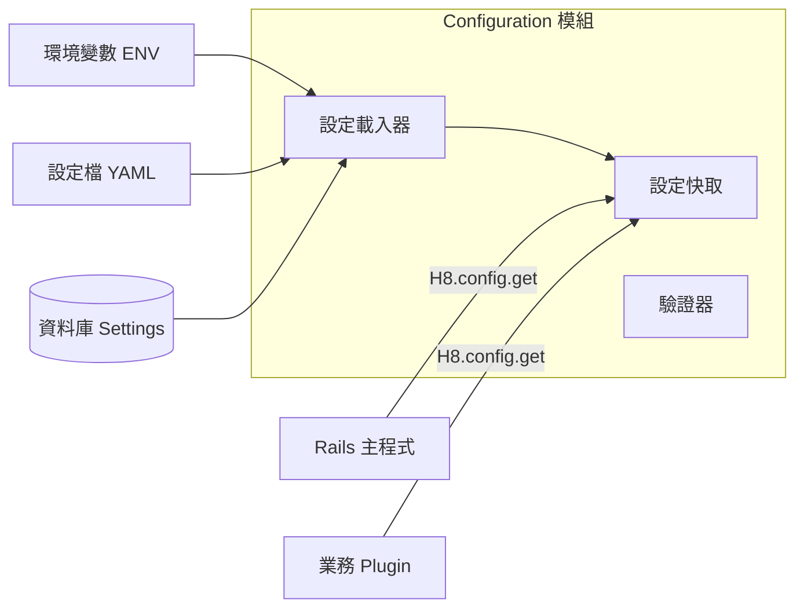

# Configuration 模組設計

> 版本：0.1 (Draft)
> 更新日期：2026-01-21

---

## 概述

Configuration 模組負責管理整個 `h8` 生態系的設定，包含核心設定、各 Plugin 的專屬設定，以及由使用者在 Runtime 動態調整的設定。

### 設計目標

| 目標 | 說明 |
|------|------|
| 統一介面 | 提供統一的 API 讀取所有設定，無需關心來源（ENV, YAML, DB） |
| 分層管理 | 支援 預設值 < 設定檔 < 環境變數 < 資料庫 的優先級覆蓋機制 |
| Plugin 支援 | 允許 Plugin 註冊自己的設定項、預設值與驗證規則 |
| 動態更新 | 支援 Runtime 熱更新設定（針對資料庫層級設定） |
| 安全性 | 對於敏感資料（如 API Key）提供加密儲存與遮罩顯示 |

---

## 設定分層與優先級

設定值讀取時，依以下順序由高至低優先級覆蓋：

> **設計決策：為什麼 DB > ENV？**
> 1.  **Runtime 優先權**：ENV 修改通常需重啟服務，DB 允許管理員在**不重啟**的情況下，即時覆蓋部署設定（例如：緊急關閉網站維護模式）。
> 2.  **避免 UI 混淆**：若 ENV 優先，管理員在 Admin UI 的操作可能無效，造成「改了沒反應」的困擾。
> 3.  **效能考量**：透過**快取層 (Caching)**，實際讀取時並不會每次查詢 DB，效能損耗可忽略。

1.  **資料庫設定 (Database Settings)**
    *   由管理員在 UI 設定，儲存於 DB。
    *   優先級最高，用於 Runtime 動態調整。
    *   適用場景：網站標題、維護模式開關、SMTP 設定。
2.  **環境變數 (Environment Variables)**
    *   `H8_` 開頭的環境變數。
    *   用於部署環境差異化。
    *   適用場景：`H8_DATABASE_HOST`、`H8_REDIS_URL`。
3.  **設定檔 (config/*.yml)**
    *   專案目錄下的 YAML 設定檔（如 `config/h8.yml`）。
    *   用於靜態且不常變動的配置。
4.  **Plugin 預設值 (Plugin Defaults)**
    *   Plugin 註冊時定義的預設值。
5.  **核心預設值 (Core Defaults)**
    *   系統內建的預設值。

---

## 架構設計



---

## API 設計

### 核心介面 (Developers)

```ruby
# 讀取設定 (支援點記法)
H8.config.get('app.name')
H8.config.app.name # 語法糖

# 讀取帶有預設值的設定
H8.config.get('logging.level', default: 'info')

# 檢查是否存在
H8.config.exist?('plugin_a.feature_flag')

# 寫入設定 (僅限 DB 層，通常由 Admin UI 呼叫)
H8.config.set('app.maintenance_mode', true)
```

### Plugin 註冊介面

Plugin 應在 `engine.rb` 或初始化階段註冊其所需的設定項，以便系統生成 Admin UI 表單並進行驗證：

```ruby
# plugin-a/lib/h8/plugin_a/engine.rb
module H8
  module PluginA
    class Engine < ::Rails::Engine
      initializer "h8_plugin_a.register_config" do
        H8.config.register_plugin(:plugin_a) do |c|
          # 定義設定項
          c.define 'feature_flag', 
                   default: false, 
                   type: :boolean, 
                   description: '開啟新功能'
          
          # 定義敏感設定
          c.define 'api_key', 
                   type: :string, 
                   secret: true,
                   description: '第三方服務 API Key'
          
          # 定義帶驗證的設定
          c.define 'retry_count', 
                   default: 3, 
                   type: :integer, 
                   validation: { min: 1, max: 10 }
        end
      end
    end
  end
end
```

---

## 資料儲存設計

### 資料庫 Schema (`h8_settings`)

除標準 Rails 設定外，動態設定儲存於資料庫：

| 欄位 | 類型 | 說明 |
|------|-----|------|
| `id` | bigint | PK |
| `var` | string | 設定鍵值 (Key)，如 `logging.level`，唯一索引 |
| `value` | text | 設定值 (序列化儲存，YAML/JSON) |
| `data_type` | string | 資料型別 (string, integer, boolean, array, hash) |
| `is_encrypted` | boolean | 是否加密儲存 |
| `plugin_name` | string | 所屬 Plugin 名稱 (Core 使用 `core`) |
| `created_at` | datetime | 建立時間 |
| `updated_at` | datetime | 更新時間 |

---

## 實現細節

### 與 Rails Configuration 整合
*   `H8::Configuration` 是 Rails `config` 的補充，專注於**業務邏輯**與**Plugin**設定。
*   基礎設施設定 (如 Database, Puma) 仍依循 Rails 標準 (`database.yml`, `puma.rb`)。

### 快取機制 Cache Strategy
*   **多級快取**：
    1.  **Request Store**：單次請求內重複讀取不查 DB。
    2.  **Rails.cache (Redis)**：全域快取，減少 DB 壓力。
*   **Cache Invalidation**：當呼叫 `H8.config.set` 更新 DB 時，需發送事件或直接清除對應 Cache Key。

### 敏感資料處理
*   **儲存**：標記為 `secret: true` 的設定，在寫入 DB 前使用 Rails `ActiveSupport::MessageEncryptor` 加密。
*   **顯示**：在 Admin UI 或 Logs 中，預設顯示為 `******` 或部分遮罩。
*   **輸出**：`H8.config.get` 預設回傳解密後明文，供程式內部使用。
