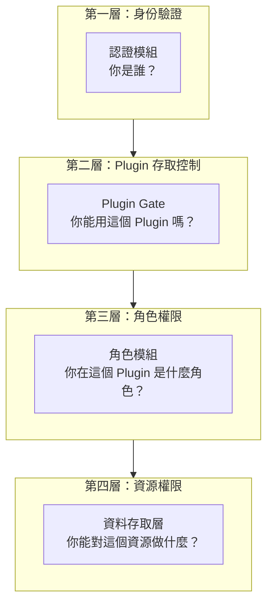
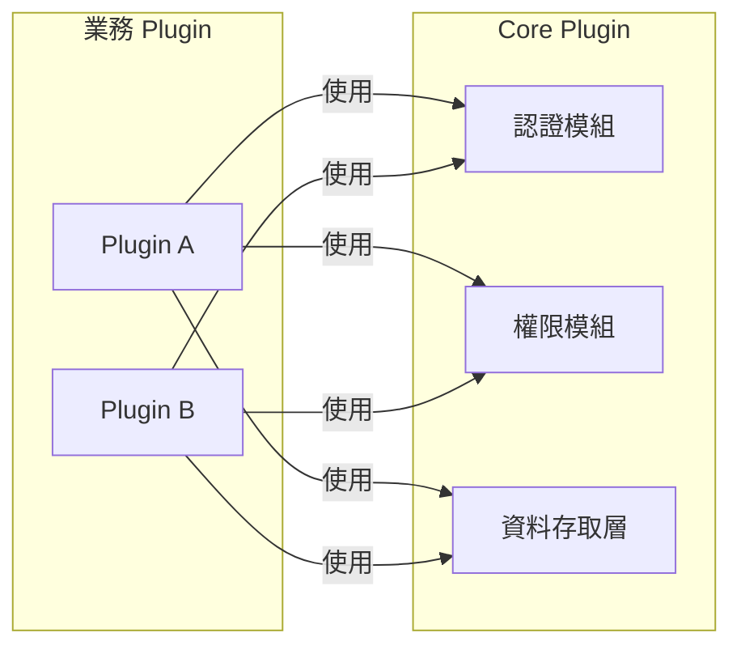

# Core Plugin 開發指南

> 核心 Plugin — 提供認證、權限、資料存取層等基礎設施

## 概述

Core Plugin 是平台方開發維護的基礎設施，所有業務 Plugin 都依賴於此。

---

## 模組架構

```
core_plugin/
├── lib/
│   └── core_plugin/
│       ├── engine.rb         # Rails Engine 進入點
│       ├── auth/             # 認證模組
│       │   ├── token_validator.rb
│       │   └── current_user_helper.rb
│       ├── plugin_access/    # Plugin 存取控制
│       │   ├── gate.rb
│       │   └── subscription.rb
│       ├── role/             # 角色與權限模組
│       │   ├── role_registry.rb
│       │   └── role_checker.rb
│       └── data_access/      # 資料存取層 (DAL)
│           ├── api.rb
│           ├── permission.rb
│           └── read_only_proxy.rb
├── app/
│   ├── models/               # 共用 Model
│   ├── policies/             # 基礎 Policy
│   └── services/             # 共用 Service
├── config/
│   └── initializers/
└── spec/                     # 測試
```

---

## 權限分層架構



| 層級 | 模組 | 問題 | 控制者 |
|-----|------|------|--------|
| 1 | 認證模組 | 你是誰？ | Keycloak + JWT |
| 2 | Plugin Gate | 你能用這個 Plugin 嗎？ | 主系統（訂閱/授權） |
| 3 | 角色模組 | 你在 Plugin 中是什麼角色？ | 主系統 + Plugin |
| 4 | 資料存取層 | 你能對資源做什麼操作？ | Plugin Policy |

---

## 模組說明

### 1. 認證模組 (`auth/`)

| 檔案 | 職責 |
|-----|------|
| `token_validator.rb` | 驗證 Keycloak JWT Token |
| `current_user_helper.rb` | 提供 `current_user` 給 Controller |

**對外介面**：
```ruby
# Controller 中自動可用
current_user          # => User instance
current_user.id       # => user_id from token
user_signed_in?       # => boolean
```

### 2. Plugin 存取控制 (`plugin_access/`)

| 檔案 | 職責 |
|-----|------|
| `gate.rb` | 檢查用戶是否有權使用某 Plugin |
| `subscription.rb` | 管理用戶/組織的 Plugin 訂閱狀態 |

**對外介面**：
```ruby
# 檢查用戶能否使用 Plugin
PluginAccess::Gate.can_access?(user: current_user, plugin: :plugin_a)

# 在 Controller 中使用（自動檢查）
class PluginA::BaseController < ApplicationController
  before_action :authorize_plugin_access!
end

# 取得用戶可用的 Plugin 清單
current_user.accessible_plugins  # => [:core, :plugin_a, :plugin_c]

# 管理訂閱（管理員操作）
PluginAccess::Subscription.grant(user: user, plugin: :plugin_b)
PluginAccess::Subscription.revoke(user: user, plugin: :plugin_b)
```

**授權模式**：

| 模式 | 說明 | 範例 |
|-----|------|------|
| 全域開放 | 所有用戶都能用 | Core Plugin |
| 角色授權 | 特定角色自動獲得 | `admin` 角色可用所有 Plugin |
| 個別授權 | 逐一授權給用戶 | 進階功能 Plugin |
| 組織授權 | 授權給整個組織 | 企業方案 |

### 3. 角色模組 (`role/`)

| 檔案 | 職責 |
|-----|------|
| `role_registry.rb` | Plugin 角色註冊機制 |
| `role_checker.rb` | 角色檢查輔助方法 |

**對外介面**：
```ruby
# Plugin 註冊角色
RoleRegistry.register do |r|
  r.role :my_plugin_admin, 
         display_name: '管理員',
         description: '...'
end

# 檢查角色
current_user.has_role?(:admin)
current_user.roles  # => [:member, :admin]
```

### 4. 資料存取層 (`data_access/`)

| 檔案 | 職責 |
|-----|------|
| `api.rb` | 統一存取介面 |
| `permission.rb` | 資源權限定義 |
| `read_only_proxy.rb` | 唯讀保護封裝 |

**對外介面**：
```ruby
# 查詢共用資料
DataAccess::API.find('User', 1, requester: 'my_plugin')
DataAccess::API.where('User', { role: 'admin' }, requester: 'my_plugin')

# 檢查權限
DataAccess::Permission.can?(
  plugin: 'my_plugin',
  role: 'editor',
  resource: 'Article',
  action: :write
)
```

---

## 對外介面規格

### 認證介面

| 方法 | 回傳 | 說明 |
|-----|------|------|
| `current_user` | User | 當前登入使用者 |
| `user_signed_in?` | Boolean | 是否已登入 |
| `authenticate_user!` | - | 強制要求登入，否則 401 |

### Plugin 存取控制介面

| 方法 | 回傳 | 說明 |
|-----|------|------|
| `PluginAccess::Gate.can_access?(user:, plugin:)` | Boolean | 檢查用戶能否使用 Plugin |
| `authorize_plugin_access!` | - | Controller 中檢查，失敗回 403 |
| `current_user.accessible_plugins` | Array | 用戶可用的 Plugin 清單 |
| `PluginAccess::Subscription.grant(user:, plugin:)` | - | 授權用戶使用 Plugin |
| `PluginAccess::Subscription.revoke(user:, plugin:)` | - | 撤銷用戶的 Plugin 權限 |

### 角色介面

| 方法 | 回傳 | 說明 |
|-----|------|------|
| `RoleRegistry.register { }` | - | 註冊 Plugin 角色 |
| `RoleRegistry.pending_roles` | Array | 待審核角色清單 |
| `RoleRegistry.approved_roles` | Array | 已核准角色清單 |
| `current_user.has_role?(role)` | Boolean | 檢查是否有角色 |
| `current_user.roles` | Array | 使用者所有角色 |

### DAL 介面

| 方法 | 回傳 | 說明 |
|-----|------|------|
| `DataAccess::API.find(model, id, requester:)` | Record | 查詢單筆 |
| `DataAccess::API.where(model, conditions, requester:)` | Array | 查詢多筆 |
| `DataAccess::API.write(model, attrs, requester:, role:)` | Record | 寫入資料 |
| `DataAccess::Permission.can?(...)` | Boolean | 檢查權限 |

---

## 與業務 Plugin 的邊界



### 責任劃分

| 項目 | Core Plugin | 業務 Plugin |
|-----|-------------|-------------|
| Token 驗證 | ✅ 實作 | ❌ 不處理 |
| `current_user` | ✅ 提供 | ✅ 使用 |
| 角色定義 | ✅ 儲存 | ✅ 宣告需求 |
| 權限檢查機制 | ✅ 提供 Pundit | ✅ 撰寫 Policy |
| 共用資料存取 | ✅ 提供 DAL | ✅ 透過 DAL 存取 |
| 自有資料存取 | ❌ 不介入 | ✅ 直接 ActiveRecord |

---

## 開發狀態

| 模組 | 狀態 | 說明 |
|-----|------|------|
| 認證模組 | ⬜ 規格中 | 待定義完整介面 |
| 權限模組 | ⬜ 規格中 | 待定義完整介面 |
| 資料存取層 | ⬜ 規格中 | 待定義完整介面 |

---

## 相關文件

- [專案規格書](spec.md)
- [權限機制設計](permissions.md)
- [資料存取層設計](data.md)
