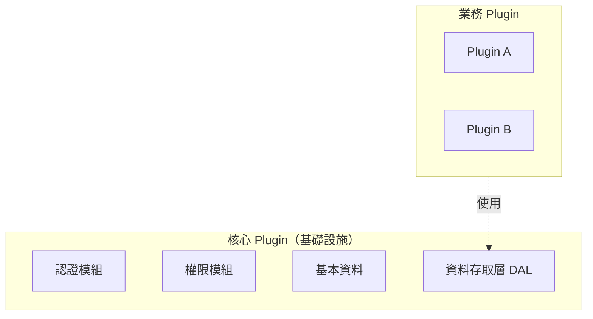
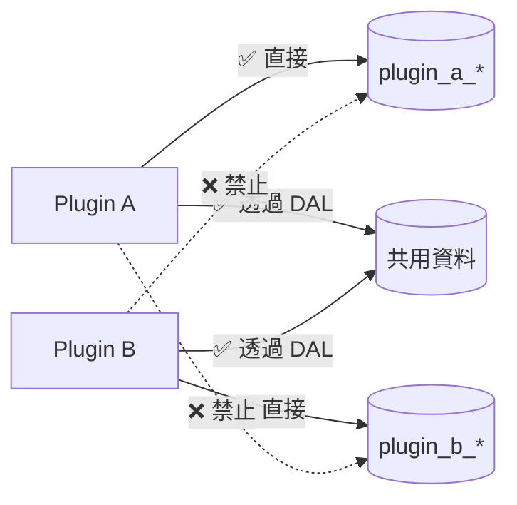
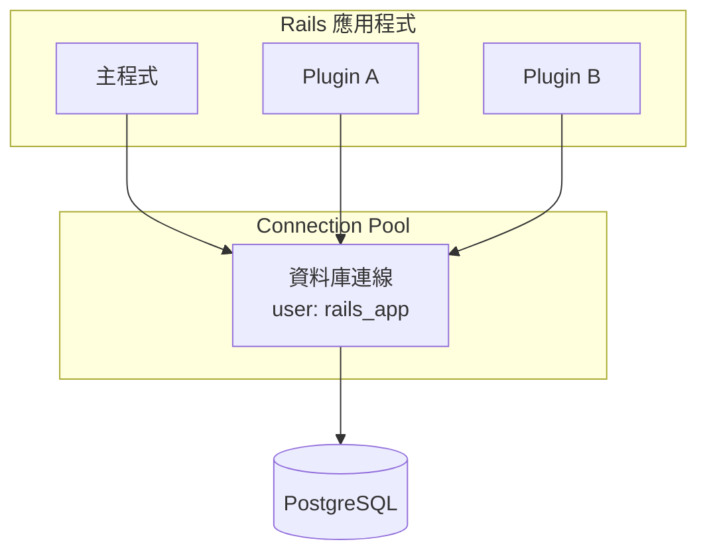

# 資料存取層設計

## 概述

資料存取層（Data Access Layer, DAL）是核心 Plugin 的一部分，負責管控業務 Plugin 對共用資料的存取。

---

## 架構定位



| 元件 | 開發者 | 維護者 | 可否移除 |
|-----|-------|-------|---------|
| 主程式（空殼） | 平台方 | 平台方 | ❌ |
| 核心 Plugin（含 DAL） | 平台方 | 平台方 | ❌ |
| 業務 Plugin | 各廠商 | 各廠商 | ✅ |

---

## 資料存取規則

### 存取權限

| 資料類型 | 存取方式 | 說明 |
|---------|---------|------|
| Plugin 自己的 table | ✅ 直接用 ActiveRecord | `PluginA::Product.where(...)` |
| 共用資料 | ⚠️ 建議透過 DAL | `DataAccess::API.find('User', ...)` |
| 其他 Plugin 的 table | ❌ 禁止 | 保持 Plugin 間隔離 |

### 隔離示意圖



---

## 管控策略

### 行政嚴格，技術寬鬆但有引導

| 層面 | 做法 | 強制程度 |
|-----|------|---------|
| **行政流程** | 規範 + Code Review + 上架審核 | 強制 |
| **技術實現** | 提供 DAL API，建議使用 | 非強制 |
| **底層** | 統一使用 ActiveRecord | - |

### 為什麼不做技術強制？

1. **Ruby 是動態語言**：無法在語言層面禁止存取其他 class
2. **共用資料庫連線**：所有 Plugin 用同一個 DB user，資料庫無法分辨來源
3. **複雜度考量**：DB 層面隔離需要每個 Plugin 獨立連線，代價太高



### 行政管控方式

| 檢查方式 | 說明 |
|---------|------|
| 開發規範 | 明確規定 Plugin 不能直接存取非自有 table |
| Code Review | PR 審核時檢查是否違反規範 |
| 上架審核 | Plugin 上架前的程式碼審查 |
| 違規處置 | 違規就下架 Plugin |

---

## 與 ActiveRecord 的關係

DAL 建立在 ActiveRecord **之上**，不是取代它：

```
┌─────────────────────────────────────┐
│  Plugin 呼叫                         │
│  DataAccess::API.find('User', 1)    │
└─────────────────┬───────────────────┘
                  ▼
┌─────────────────────────────────────┐
│  資料存取層 (DAL)                    │
│  - 檢查權限                          │
│  - 記錄 log                          │
│  - 過濾欄位                          │
└─────────────────┬───────────────────┘
                  ▼
┌─────────────────────────────────────┐
│  ActiveRecord（Rails 內建 ORM）      │
│  User.find(1)                       │
│  User.where(role: 'admin')          │
└─────────────────┬───────────────────┘
                  ▼
┌─────────────────────────────────────┐
│  資料庫                              │
└─────────────────────────────────────┘
```

| 層 | 職責 | 誰實作 |
|---|------|-------|
| **DAL** | 權限控管、欄位過濾、log | 平台方開發 |
| **ORM** | Ruby 物件 ↔ SQL 轉換 | Rails 內建 (ActiveRecord) |
| **Database Driver** | 連接資料庫 | pg / mysql2 / oracle gem |

---

## DAL API 功能

DAL 提供的價值：

| 功能 | 說明 |
|-----|------|
| 統一介面 | 存取共用資料的標準方式 |
| 欄位過濾 | 只回傳允許的欄位，避免誤拿敏感資料 |
| 存取記錄 | 自動 log，可追蹤誰存取了什麼 |
| 唯讀保護 | 回傳 ReadOnlyProxy，防止誤改共用資料 |

### 使用範例

```ruby
# 業務 Plugin 使用 DAL 存取共用資料
class MyPluginController < ApplicationController
  def show_user_info
    # 透過 DAL 存取，自動過濾欄位、記錄 log
    user = DataAccess::API.find('User', params[:id], 
                                 requester: 'my_plugin')
    
    render json: {
      id: user.id,
      name: user.display_name
    }
  end
end
```

---

## Plugin 間資料交換

當 Plugin 間需要交換資料時，有三種建議做法：

| 方式 | 說明 | 適合場景 |
|-----|------|---------|
| **共用資料層** | Plugin B 將資料註冊到 DAL | 多個 Plugin 都需要的資料 |
| **Service 介面** | Plugin B 提供公開 Service | 偶爾需要查詢 |
| **事件訂閱** | 使用 `ActiveSupport::Notifications` | 需要即時通知 |

### Service 介面範例

```ruby
# Plugin B 提供的公開 Service
module PluginB
  class OrderService
    def self.find_by_user(user_id)
      Order.where(user_id: user_id).select(:id, :status, :total)
    end
  end
end

# Plugin A 使用
orders = PluginB::OrderService.find_by_user(current_user.id)
```

### 事件訂閱範例

```ruby
# Plugin B：發布事件
module PluginB
  class Order < ApplicationRecord
    after_create :publish_created_event
    
    private
    
    def publish_created_event
      ActiveSupport::Notifications.instrument(
        'plugin_b.order.created',
        order_id: id,
        user_id: user_id,
        total: total
      )
    end
  end
end

# Plugin A：訂閱事件
module PluginA
  class Engine < ::Rails::Engine
    initializer 'plugin_a.subscribe_events' do
      ActiveSupport::Notifications.subscribe('plugin_b.order.created') do |*args|
        event = ActiveSupport::Notifications::Event.new(*args)
        payload = event.payload
        
        PluginA::PointService.add_points(
          user_id: payload[:user_id],
          amount: payload[:total] * 0.01
        )
      end
    end
  end
end
```

---

## 總結

1. **DAL 是核心 Plugin 的一部分**，由平台方開發維護
2. **行政上嚴格管控**：規範 + Code Review + 上架審核
3. **技術上提供引導**：DAL API 讓「做對的事比較容易」
4. **不做技術強制**：Ruby/Rails 架構限制，且複雜度代價太高
5. **底層都是 ActiveRecord**：DAL 是在 ORM 上的一層封裝
