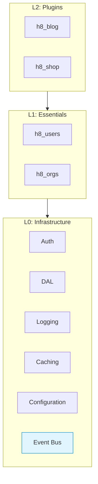
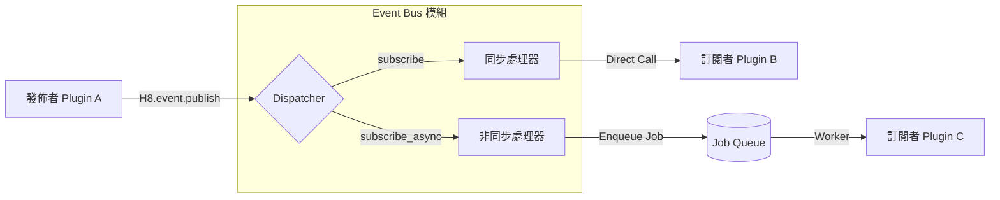

# Event/Message Bus 模組設計

> 版本：0.1 (Draft)
> 更新日期：2026-01-21

---

## 概述

Event Bus (事件匯流排) 是實現 Plugin 間「鬆散耦合 (Loose Coupling)」的關鍵機制。它允許發送者 (Publisher) 在不認識接收者 (Subscriber) 的情況下廣播事件，從而實現模組間的解耦與擴充。

### 設計目標

| 目標 | 說明 |
|------|------|
| 解耦 (Decoupling) | A Plugin 不需依賴 B Plugin 即可觸發 B 的業務邏輯 |
| 統一介面 | 提供標準化的 Publish/Subscribe API |
| 支援同步與非同步 | 區分「即時處理 (In-Process)」與「背景處理 (Background Job)」場景 |
| 可觀察性 | 事件流可被監控、記錄與除錯 |

---

## 架構定位

Event Bus 模組屬於 **L0: Infrastructure（基礎設施層）**，是 `h8_core` 的一部分。



| 層級 | 說明 |
|:---:|:-----|
| **L0** | Event Bus 模組位於此層，提供跨模組的 Pub/Sub 機制 |
| **L1** | Essentials Plugin 可發佈與訂閱系統核心事件 |
| **L2** | 業務 Plugin 透過事件機制與其他 Plugin 解耦互動 |

---

## 架構設計

本模組基於 Rails 標準的 **ActiveSupport::Notifications** 進行封裝，並整合 **ActiveJob** 以支援非同步事件。



---

## 核心概念

### 1. 同步事件 (Synchronous Events)
*   **機制**：基於 Ruby Process 記憶體內直接呼叫。
*   **特性**：即時、阻塞 (Blocking)、具交易一致性 (同 Transaction)。
*   **用途**：資料驗證、關聯資料更新、快取清除。
*   **底層**：`ActiveSupport::Notifications`。

### 2. 非同步事件 (Asynchronous Events)
*   **機制**：將事件序列化後放入 Job Queue。
*   **特性**：延遲、非阻塞 (Non-blocking)、最終一致性。
*   **用途**：發送 Email、第三方 API 呼叫、複雜報表計算。
*   **底層**：`ActiveJob` (搭配 Sidekiq / SolidQueue)。

---

## API 設計

### 發佈事件 (Publish)

```ruby
# 基本發佈
H8.event.publish('user.created', user_id: 123, email: 'test@example.com')

# 發佈並指定 ID (用於追蹤)
H8.event.publish('order.paid', { order_id: 456 }, id: request.request_id)
```

### 訂閱事件 (Subscribe)

Plugin 應在 `engine.rb` 初始化階段註冊訂閱者。

#### 同步訂閱 (Synchronous)

```ruby
# plugin-wallet/lib/h8/wallet/engine.rb
initializer "h8_wallet.subscribe_events" do
  # 當使用者建立，立即建立錢包 (需在同一個 Transaction 內完成以免資料不一致)
  H8.event.subscribe('user.created') do |payload|
    Wallet.create!(user_id: payload[:user_id])
  end
end
```

#### 非同步訂閱 (Asynchronous)

```ruby
# plugin-mail/lib/h8/mail/engine.rb
initializer "h8_mail.subscribe_events" do
  # 當訂單付款，背景發送通知
  H8.event.subscribe_async('order.paid', job_class: H8::Mail::SendReceiptJob)
end
```

其實作原理是 Event Bus 會自動將 payload 轉發給指定的 Job Class `perform` 方法。

---

## 命名規範

事件名稱應遵循以下格式，使用點號分隔：

`<namespace>.<resource>.<action>`

| 部分 | 說明 | 範例 |
|------|------|------|
| `namespace` | 來源 Plugin 名稱 | `auth`, `shop`, `blog` |
| `resource` | 資源名稱 | `user`, `order`, `post` |
| `action` | 動作 (過去式) | `created`, `updated`, `deleted`, `paid` |

**範例**：
*   `auth.user.login`
*   `shop.order.cancelled`
*   `core.config.changed`

---

## 其實作細節

### Adapter 模式

雖然預設使用 `ActiveSupport::Notifications`，但我們預留 Adapter 介面，未來可擴充至外部 Message Broker。

| Adapter | 適用場景 | 說明 |
|---------|---------|------|
| **Memory (Default)** | 單體架構 | 使用 Rails 內建機制，零依賴。 |
| **Redis Pub/Sub** | 多實例/微服務 | 適合需要跨 Process 即時通知 (如 WebSocket 廣播)。 |
| **Kafka / RabbitMQ** | 大型分散式 | 極高吞吐量與持久化需求 (目前暫不實作)。 |

### 錯誤處理

*   **同步事件**：若訂閱者拋出例外，**會中斷發佈者的流程** (且會 Rollback Transaction)。這是設計好的行為，確保強一致性。
*   **非同步事件**：若 Job 失敗，由 Job Queue 機制 (Sidekiq) 負責重試 (Retry)。

---

## 與其他模組的整合

### 與 Logging 整合
Event Bus 會自動記錄所有發佈的事件至 Log：
`[EventBus] Published event: user.created, payload: {...}`

### 與 Caching 整合 (解耦快取清除)
這是 Event Bus 最常見的用途之一：

```ruby
# Plugin A (Shop)
def update
  product.update!(params)
  H8.event.publish('shop.product.updated', id: product.id)
end

# Plugin B (Search Indexer)
H8.event.subscribe('shop.product.updated') do |payload|
  SearchIndex.update(payload[:id]) # 更新搜尋索引
end

# Plugin C (Frontend Cache)
H8.event.subscribe('shop.product.updated') do |payload|
  H8.cache.delete("product_view_#{payload[:id]}") # 清除快取
end
```
