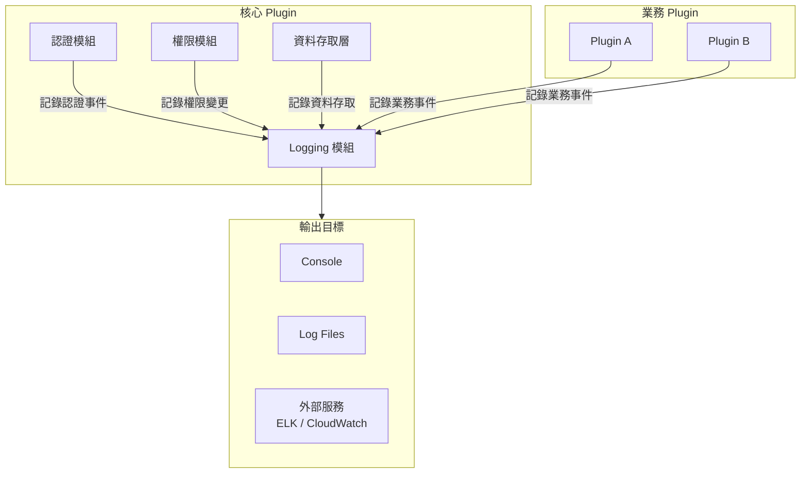
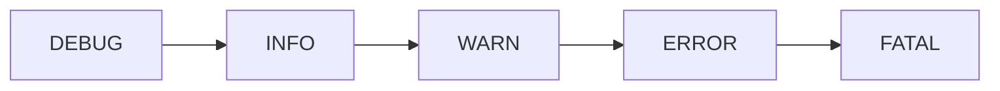
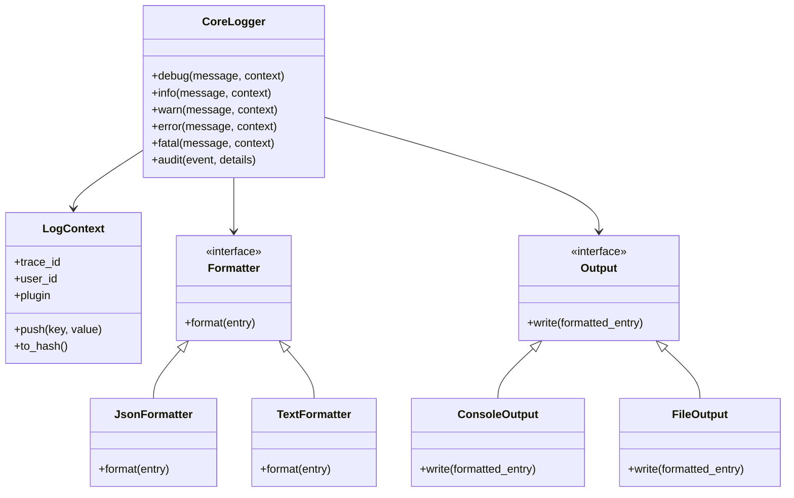
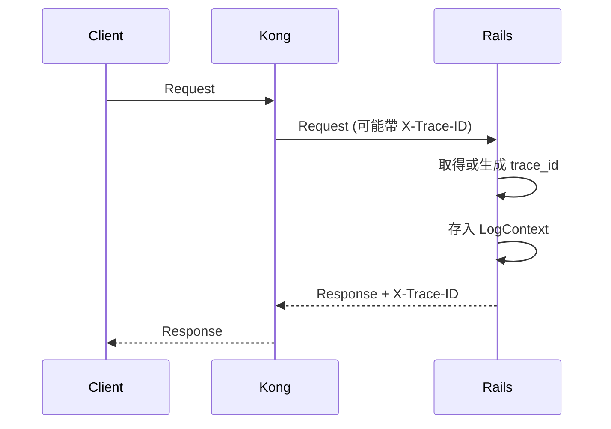
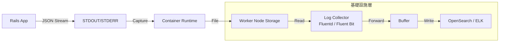

# Logging 模組設計

> 版本：1.0  
> 更新日期：2026-01-20

---

## 概述

Logging 模組是核心 Plugin 的基礎設施之一，負責提供統一的日誌記錄機制，包含應用程式日誌、存取日誌、稽核日誌等。

### 設計目標

| 目標 | 說明 |
|------|------|
| 統一介面 | 所有 Plugin 使用一致的 Logging API |
| 結構化 | 日誌以結構化格式輸出，便於查詢分析 |
| 可追蹤 | 支援 Request Tracing，跨服務追蹤 |
| 可擴充 | 支援多種輸出目標（Console、File、外部服務）|
| 效能考量 | 非同步寫入，不影響主流程效能 |

---

## 架構定位



---

## 日誌分類

### 日誌類型

| 類型 | 用途 | 敏感度 |
|------|------|--------|
| **Application Log** | 程式運行狀態、錯誤追蹤 | 低 |
| **Access Log** | HTTP 請求紀錄 | 中 |
| **Audit Log** | 重要操作稽核紀錄 | 高 |
| **Security Log** | 安全相關事件 | 高 |

### 日誌層級



| 層級 | 用途 | 範例 |
|------|------|------|
| `DEBUG` | 開發除錯資訊 | 變數值、SQL 查詢 |
| `INFO` | 正常操作紀錄 | 使用者登入、訂單建立 |
| `WARN` | 潛在問題警告 | 連線逾時重試、快取失效 |
| `ERROR` | 錯誤但可恢復 | API 呼叫失敗、資料驗證錯誤 |
| `FATAL` | 嚴重錯誤，服務中斷 | 資料庫連線失敗、記憶體不足 |

---

## 日誌格式

### 結構化日誌規格

所有日誌採用 JSON 格式輸出：

```json
{
  "timestamp": "2026-01-20T10:30:45.123Z",
  "level": "INFO",
  "logger": "PluginA::OrderService",
  "message": "Order created successfully",
  "trace_id": "abc123def456",
  "context": {
    "user_id": "550e8400-e29b-41d4-a716-446655440000",
    "plugin": "plugin_a"
  }
}
```

### 欄位說明

| 欄位 | 類型 | 必要 | 說明 | 來源 |
|------|------|------|------|------|
| `timestamp` | ISO 8601 | ✅ | UTC 時間戳 | `Time.now.utc.iso8601(3)` |
| `level` | string | ✅ | 日誌層級 | 呼叫的方法決定 |
| `logger` | string | ✅ | 日誌來源 | `self.class.name` |
| `message` | string | ✅ | 日誌訊息 | 呼叫者傳入 |
| `trace_id` | string | ✅ | 請求追蹤 ID | Middleware 注入 |
| `context` | object | ⬜ | 業務上下文 | 呼叫者傳入 |
| `error` | object | ⬜ | 錯誤資訊 | 呼叫者傳入（含 stack trace）|

---

## 模組架構

### 目錄結構

```
core_plugin/
└── lib/
    └── core_plugin/
        └── logging/
            ├── logger.rb           # 主要 Logger 類別
            ├── formatters/
            │   ├── json_formatter.rb
            │   └── text_formatter.rb
            ├── outputs/
            │   ├── console_output.rb
            │   ├── file_output.rb
            │   └── external_output.rb
            ├── middleware/
            │   └── request_logger.rb
            ├── context.rb          # 上下文管理
            └── audit.rb            # 稽核日誌
```

### 類別關係



---

## API 設計

### 基本用法

```ruby
# 取得 Logger 實例
logger = CorePlugin::Logging.logger

# 記錄各層級日誌
logger.debug("Processing request", request_id: 123)
logger.info("Order created", order_id: 456, amount: 1000)
logger.warn("Retry attempt", attempt: 3, max: 5)
logger.error("API call failed", service: "payment", error: e.message)
logger.fatal("Database connection lost")
```

### Controller Helper

```ruby
class ApplicationController < ActionController::Base
  include CorePlugin::Logging::ControllerHelper
  
  # 自動可用的方法
  # core_logger      - Logger 實例
  # core_log_context - 當前請求的上下文
end

class OrdersController < ApplicationController
  def create
    core_logger.info("Creating order", params: order_params.to_h)
    
    order = Order.create!(order_params)
    
    core_logger.info("Order created", order_id: order.id)
  rescue => e
    core_logger.error("Order creation failed", error: e.message)
    raise
  end
end
```

### 上下文管理

```ruby
# 自動注入請求上下文
CorePlugin::Logging.with_context(user_id: current_user.id, plugin: 'plugin_a') do
  # 此區塊內的所有日誌自動帶有上下文
  logger.info("Starting process")  # 自動包含 user_id, plugin
  
  perform_some_work
  
  logger.info("Process completed")
end
```

### 稽核日誌

```ruby
# 記錄重要操作（自動持久化到資料庫）
CorePlugin::Logging.audit(
  event: 'user.role_changed',
  actor: current_user,
  target: target_user,
  changes: { role: ['viewer', 'editor'] },
  ip_address: request.remote_ip
)
```

---

## Request Tracing

### Trace ID 生成與傳遞



### Trace ID 規格

| 項目 | 規格 |
|------|------|
| 格式 | UUID v4 |
| Header 名稱 | `X-Trace-ID` |
| 生成者 | Rails Middleware |
| 生成方式 | `SecureRandom.uuid` |

**注意**：若上游已帶有 `X-Trace-ID` Header，則沿用該值，否則由 Rails 生成。

### Middleware 實作

```ruby
module CorePlugin
  module Logging
    class RequestLoggerMiddleware
      def initialize(app)
        @app = app
      end
      
      def call(env)
        # 優先使用上游傳入的 trace_id，否則自行生成
        trace_id = env['HTTP_X_TRACE_ID'].presence || SecureRandom.uuid
        
        CorePlugin::Logging.with_context(trace_id: trace_id) do
          status, headers, response = @app.call(env)
          
          # 回傳時帶上 trace_id，方便追蹤
          headers['X-Trace-ID'] = trace_id
          
          [status, headers, response]
        end
      end
    end
  end
end
```

---

## 稽核日誌（Audit Log）

### 用途

記錄需要長期保存、供事後追查的重要操作：

| 類別 | 事件範例 |
|------|---------|
| 認證 | 登入、登出、Token 刷新 |
| 權限 | 角色指派、權限變更 |
| 資料 | 敏感資料存取、批次刪除 |
| 設定 | 系統設定變更、Plugin 啟停用 |

### 資料結構

```ruby
# core_audit_logs table
create_table :core_audit_logs do |t|
  t.string   :trace_id,      null: false
  t.string   :event,         null: false    # 事件類型
  t.string   :actor_type                     # 操作者類型
  t.string   :actor_id                       # 操作者 ID
  t.string   :target_type                    # 目標類型
  t.string   :target_id                      # 目標 ID
  t.string   :plugin                         # 來源 Plugin
  t.jsonb    :changes,       default: {}    # 變更內容
  t.jsonb    :metadata,      default: {}    # 額外資訊
  t.string   :ip_address
  t.string   :user_agent
  t.datetime :created_at,    null: false
  
  t.index :trace_id
  t.index :event
  t.index :actor_id
  t.index :target_id
  t.index :created_at
end
```

### 事件命名規範

採用 `<resource>.<action>` 格式：

```
user.login
user.logout
user.role_assigned
user.role_removed
order.created
order.cancelled
plugin.enabled
plugin.disabled
setting.updated
```

---

## 安全性考量

### 敏感資料過濾

```ruby
# 設定需過濾的欄位
CorePlugin::Logging.configure do |config|
  config.filtered_params = [
    :password,
    :password_confirmation,
    :token,
    :secret,
    :credit_card,
    :ssn
  ]
end

# 日誌輸出時自動過濾
# { password: "secret123" } → { password: "[FILTERED]" }
```

### 日誌存取控制

| 日誌類型 | 存取權限 |
|---------|---------|
| Application Log | 開發者、維運人員 |
| Access Log | 維運人員 |
| Audit Log | 稽核人員、管理者 |
| Security Log | 資安人員、管理者 |

---

## 輸出配置

### 輸出目標

| 環境 | 輸出目標 | 格式 |
|------|---------|------|
| development | Console (STDOUT) | Text（人類可讀）|
| production | Console (STDOUT) | JSON（結構化）|

**說明**：
- 採用 [12-Factor App](https://12factor.net/logs) 原則，應用程式只輸出到 STDOUT。
- 日誌收集、轉發、儲存由執行環境（Container / Kubernetes）處理。
- 不在應用程式層處理日誌檔案輪轉。
- **單行原則 (One Log Per Line)**：無論是 JSON (JSON Lines) 或 Text 格式，每筆日誌必定不換行，以避免 Log Collector 解析錯誤或多行堆疊錯亂。

### 日誌收集架構 (Log Aggregation)

應用程式不直接連接外部日誌服務，而是透過標準輸出 (STDOUT) 交由基礎設施處理。這種「應用程式不知情」的設計能最大程度降低耦合度。



這意味著 Rails `config.log_formatter` 必須確保 Production 環境輸出的是 **單行 JSON**，以便 Collector 解析。

---

## 效能考量

### 同步 vs 非同步寫入

| 模式 | 優點 | 缺點 |
|------|------|------|
| 同步寫入 | 實作簡單、日誌即時 | 可能影響請求效能 |
| 非同步寫入 | 不阻塞主流程 | 實作複雜、可能遺失日誌 |

初期採用**同步寫入**，直接使用 Ruby Logger。

---

## Plugin 整合

### Plugin 使用範例

```ruby
# Plugin 中使用 Logger
module PluginA
  class OrderService
    include CorePlugin::Logging::Loggable
    
    def create_order(params)
      core_logger.info("Creating order", params: params)
      
      order = Order.create!(params)
      
      # 記錄稽核日誌
      core_audit('order.created', target: order, changes: params)
      
      core_logger.info("Order created", order_id: order.id)
      order
    rescue => e
      core_logger.error("Order creation failed", 
        error: e.message, 
        backtrace: e.backtrace.first(5)
      )
      raise
    end
  end
end
```

### 自動上下文注入

Plugin 的日誌自動包含 Plugin 識別：

```json
{
  "timestamp": "2026-01-20T10:30:45.123Z",
  "level": "INFO",
  "logger": "PluginA::OrderService",
  "message": "Order created",
  "context": {
    "plugin": "plugin_a",
    "trace_id": "abc123",
    "user_id": "user-456"
  }
}
```

---

## 相關文件

| 文件 | 說明 |
|------|------|
| [認證模組](../auth/README.md) | 認證相關日誌事件 |
| [權限機制](../permissions/permissions.md) | 權限變更日誌 |
| [資料存取層](../data/data.md) | 資料存取日誌 |
| [命名規範](../../naming-conventions.md) | 欄位命名規則 |

---

## 待確認事項

以下事項需要後續討論決定：

### 1. 外部日誌服務整合

是否需要整合外部日誌服務？若需要，選擇哪個？

| 選項 | 說明 |
|------|------|
| 不整合 | 僅輸出到 STDOUT，由 K8s/Docker 處理 |
| ELK Stack | 自建，完全控制 |
| AWS CloudWatch | 若使用 AWS |
| Datadog | SaaS，功能完整 |

### 2. 是否需要 span_id

`span_id` 用於分散式追蹤，記錄請求中的各個操作區段。

| 選項 | 適用情境 |
|------|----------|
| 不需要 | 單體 Rails 應用、初期開發 |
| 需要 | 微服務架構、整合 OpenTelemetry |

### 3. 監控與告警機制

| 問題 | 選項 |
|------|------|
| 使用什麼監控工具？ | Prometheus / Datadog / CloudWatch |
| 告警規則由誰定義？ | 維運團隊 / 應用程式內建 |
| 告警通知管道？ | Slack / Email / PagerDuty |

### 4. 日誌存取權限管理

| 問題 | 說明 |
|------|------|
| 誰可以查看 Audit Log？ | 需定義角色與權限 |
| 是否需要日誌查詢 UI？ | 或僅透過外部工具查詢 |

### 5. 非同步寫入

初期採用同步寫入。若未來有效能問題，需評估：

| 項目 | 待決定 |
|------|--------|
| Buffer 機制 | 記憶體 / Redis / 其他 |
| Buffer 大小 | 依實際流量決定 |
| 失敗處理策略 | 丟棄 / 重試 / 降級 |
