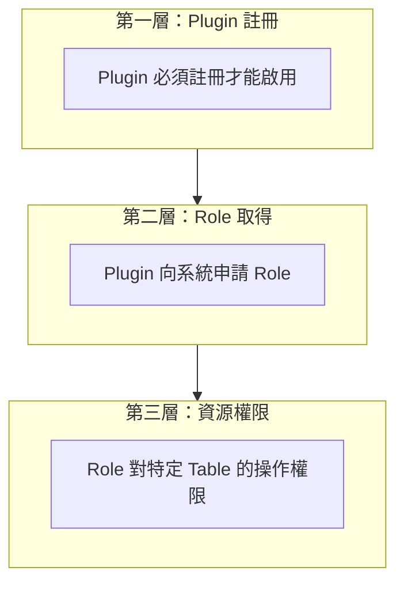
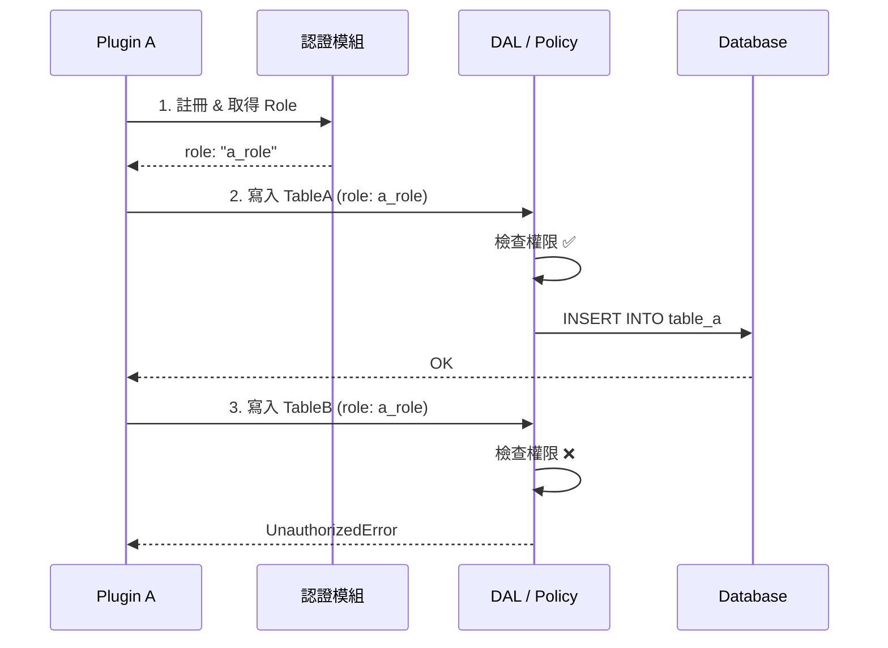
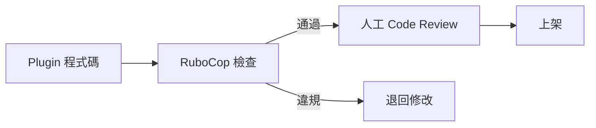

# 權限機制設計

## 概述

本文件說明 Plugin 架構中的權限控制機制，包含 Rails 生態系的權限工具、為何採用「行政嚴格、技術引導」策略，以及細粒度資源權限的實作方式。

---

## Rails 生態系權限工具

### 常見權限 Gems

| Gem | 類型 | 說明 |
|-----|------|------|
| **Pundit** | Policy-based | 定義「誰能對什麼資源做什麼操作」 |
| **CanCanCan** | Ability-based | 集中式權限定義 |
| **Action Policy** | Policy-based | 類似 Pundit，支援 i18n、快取等 |

### 為什麼這些 Gem 無法解決隔離問題？

這些權限 Gem 都是「**合作式**」設計 — 假設所有程式碼都會自願使用權限檢查：

```ruby
# 惡意 Plugin 可以完全繞過權限檢查
class EvilPlugin
  def steal_data
    # 直接呼叫 ActiveRecord，不經過任何權限檢查
    User.all                              # ← 無法阻止
    PluginB::Order.where(status: 'paid')  # ← 無法阻止
  end
end
```

Ruby 是動態語言，無法在語言層面禁止存取其他 class。

---

## 權限分層架構



| 層級 | 檢查內容 | 實作方式 |
|-----|---------|---------|
| **Plugin 註冊** | Plugin 是否已啟用 | Engine initializer |
| **Role 驗證** | Plugin 是否擁有該 Role | 核心 Plugin 的 Role 模組 |
| **資源權限** | Role 對 Table 的操作權限 | Pundit / 自訂 Policy / DAL |

---

## 細粒度資源權限

### 情境說明

Plugin A 管理 TableA 和 TableB：
- `a_role` 可以**讀寫** TableA
- `a_role` 只能**讀取** TableB（不能寫入）
- `admin_role` 可以**讀寫**兩者

### 權限定義表

```
| plugin_name | role       | resource | actions           |
|-------------|------------|----------|-------------------|
| plugin_a    | a_role     | TableA   | read,write,delete |
| plugin_a    | a_role     | TableB   | read              |
| plugin_a    | admin_role | TableA   | read,write,delete |
| plugin_a    | admin_role | TableB   | read,write        |
```

### 實作方式一：DAL 層控制

```ruby
module DataAccess
  class Permission
    PERMISSIONS = {
      'plugin_a' => {
        'a_role' => {
          'TableA' => [:read, :write, :delete],
          'TableB' => [:read]  # 只能讀，不能寫
        },
        'admin_role' => {
          'TableA' => [:read, :write, :delete],
          'TableB' => [:read, :write]
        }
      }
    }
    
    def self.can?(plugin:, role:, resource:, action:)
      PERMISSIONS.dig(plugin, role, resource)&.include?(action) || false
    end
  end
  
  class API
    def self.write(resource, attributes, requester:, role:)
      unless Permission.can?(
        plugin: requester,
        role: role,
        resource: resource,
        action: :write
      )
        raise UnauthorizedError, "#{role} 無權寫入 #{resource}"
      end
      
      resource.constantize.create(attributes)
    end
  end
end
```

### 實作方式二：Pundit Policy

```ruby
# app/policies/plugin_a/table_b_policy.rb
module PluginA
  class TableBPolicy
    attr_reader :context, :record
    
    def initialize(context, record)
      @context = context  # 包含 plugin_name, role
      @record = record
    end
    
    def read?
      true  # 所有 role 都能讀
    end
    
    def write?
      context.role == 'admin_role'  # 只有 admin_role 能寫
    end
    
    def delete?
      false  # 都不能刪
    end
  end
end
```

### 實作方式三：Model Callback

```ruby
module PluginA
  class TableB < ApplicationRecord
    before_save :check_write_permission!
    
    private
    
    def check_write_permission!
      current_context = RequestStore.store[:plugin_context]
      
      unless current_context&.role == 'admin_role'
        raise ActiveRecord::RecordNotSaved, 
              "Role #{current_context&.role} 無權寫入 TableB"
      end
    end
  end
end
```

---

## 權限檢查流程



---

## 輔助工具：RuboCop 自訂規則

雖然無法技術強制，但可以用 **RuboCop**（Ruby 靜態分析工具）在 CI/CD 階段自動檢查：

```ruby
# 自訂規則：偵測 Plugin 中直接存取 User model
module RuboCop
  module Cop
    module PluginPolicy
      class NoDirectUserAccess < Base
        MSG = '請使用 DataAccess::API 存取共用資料'
        
        def_node_matcher :direct_user_access?, <<~PATTERN
          (send (const nil? :User) ...)
        PATTERN
        
        def on_send(node)
          add_offense(node) if direct_user_access?(node)
        end
      end
    end
  end
end
```



---

## 總結

| 策略 | 做法 | 強制程度 |
|-----|------|---------|
| **Plugin 註冊** | 未註冊的 Plugin 無法啟用 | 技術強制 |
| **Role 機制** | Plugin 須向系統申請 Role | 技術強制 |
| **資源權限** | 透過 DAL / Policy 檢查 | 技術引導 |
| **靜態分析** | RuboCop 自訂規則 | 自動化輔助 |
| **行政流程** | Code Review + 上架審核 | 行政強制 |

核心原則：
1. **技術上能強制的就強制**（Plugin 註冊、Role 取得）
2. **技術上無法強制的用引導**（提供好用的 DAL API）
3. **輔以自動化工具**（RuboCop 靜態分析）
4. **最後一道防線是行政流程**（Code Review、上架審核、違規下架）
