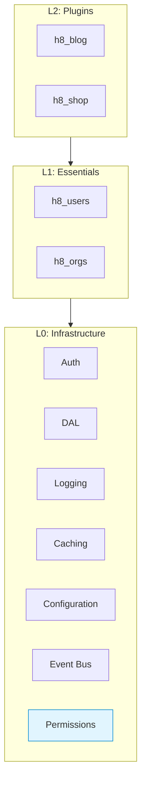
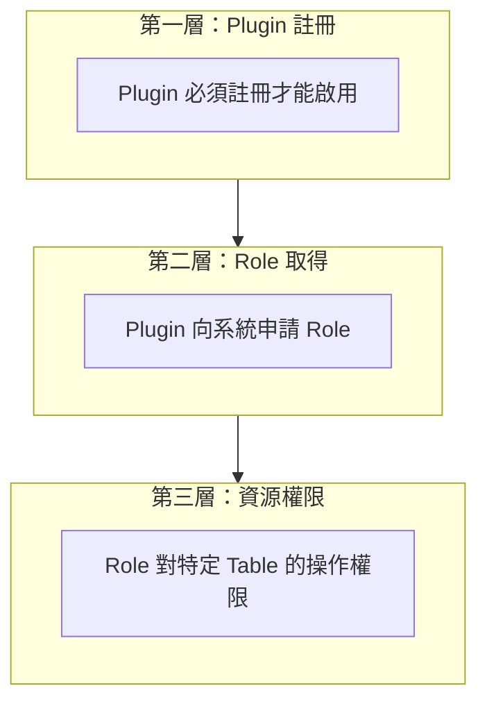
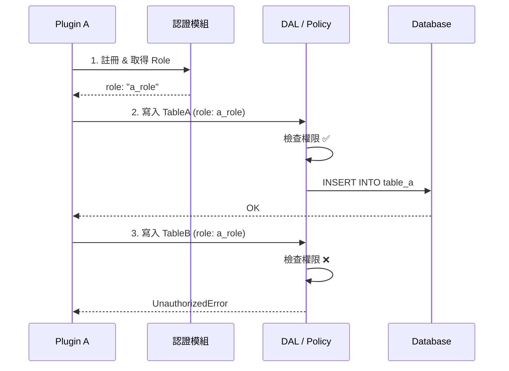
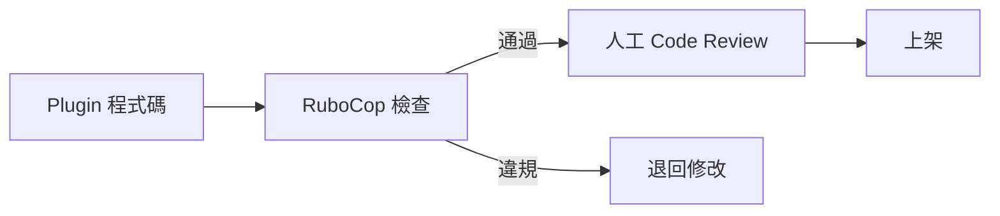

# 權限機制設計

## 概述

本文件規範 Plugin 架構中的權限控制機制。為確保 Plugin 間的資料隔離與安全性，系統採用「行政嚴格、技術引導」策略，並透過 **資料存取層 (DAL)** 強制執行資源權限檢查。

---

## 架構定位

權限模組屬於 **L0: Infrastructure（基礎設施層）**，是 `h8_core` 的一部分。



| 層級 | 說明 |
|:---:|:-----|
| **L0** | 權限模組位於此層，統一管控角色與資源存取權限 |
| **L1** | Essentials Plugin 透過 Role 機制取得系統核心資源權限 |
| **L2** | 業務 Plugin 需宣告 Role 需求，經管理員核准後方可存取 |

---

## 背景與設計決策

標準 Rails 生態系的權限 Gem（如 Pundit, CanCanCan）多採用「合作式」設計，假設程式碼會自願進行權限檢查。然而在 Plugin 架構中，我們不能假設第三方 Plugin 會自律。

若無適當隔離，惡意 Plugin 可輕易繞過檢查：

```ruby
# 惡意 Plugin 可能直接呼叫 ActiveRecord 繞過檢查
User.all
PluginB::Order.where.not(status: 'paid')
```

因此，本系統**不直接依賴**這些合作式 Gem 來做跨 Plugin 防護，而是建立強制性的 **DataAccess Layer (DAL)**。

---

## 權限檢查分層



| 層級 | 檢查內容 | 實作方式 |
|-----|---------|---------|
| **Plugin 註冊** | Plugin 是否已啟用 | Engine initializer |
| **Role 驗證** | Plugin 是否擁有該 Role | 核心 Plugin 的 Role 模組 |
| **資源權限** | Role 對 Table 的操作權限 | **Data Access Layer (DAL)** |

---

## 資源存取規範 (DAL)

所有 Plugin 開發者必須遵守以下規範：

1.  **禁止直接存取 Model**：Plugin 不可直接呼叫其他 Plugin 或核心系統的 ActiveRecord Model (如 `User` 或 `PluginB::Order`)。
2.  **必須使用 DataAccess API**：所有跨邊界的資料讀寫操作，必須透過 `DataAccess::API` 進行。

### API 介面定義

系統提供統一的存取介面，自動進行權限驗證：

```ruby
module DataAccess
  class API
    # 寫入資源
    # @param resource [String] 資源名稱 (e.g., 'TableA')
    # @param attributes [Hash] 寫入資料
    # @param requester [String] 呼叫端 Plugin 名稱
    # @param role [String] 使用的角色
    # @raise [UnauthorizedError] 若權限不足則拋出例外
    def self.write(resource, attributes, requester:, role:)
      # ... implementation details hidden ...
    end

    # 讀取資源
    def self.read(resource, query, requester:, role:)
      # ...
    end
  end
end
```

### 權限定義配置

權限表定義於各 Plugin 的配置檔中，格式如下：

```ruby
# 範例配置
PERMISSIONS = {
  'plugin_a' => {
    'a_role' => {
      'TableA' => [:read, :write, :delete],
      'TableB' => [:read]
    },
    'admin_role' => {
      'TableA' => [:read, :write, :delete],
      'TableB' => [:read, :write]
    }
  }
}
```

### 實作範例

```ruby
module DataAccess
  class Permission
    def self.can?(plugin:, role:, resource:, action:)
      PERMISSIONS.dig(plugin, role, resource)&.include?(action) || false
    end
  end
  
  class API
    def self.write(resource, attributes, requester:, role:)
      unless Permission.can?(
        plugin: requester,
        role: role,
        resource: resource,
        action: :write
      )
        raise UnauthorizedError, "#{role} 無權寫入 #{resource}"
      end
      
      resource.constantize.create(attributes)
    end
  end
end
```

---

## 權限檢查流程



---

## 靜態分析規範 (RuboCop)

為輔助開發者遵守上述規範，CI/CD 流程中已整合 RuboCop 靜態分析工具。

*   **規則名稱**: `PluginPolicy/NoDirectUserAccess`
*   **檢查行為**: 偵測並禁止 Plugin 中直接存取全域 Model (如 `User`, `Order` 等)。
*   **修正方式**: 請改用 `DataAccess::API` 存取共用資料。



---

## 總結

| 策略 | 做法 | 強制程度 |
|-----|------|---------|
| **Plugin 註冊** | 未註冊的 Plugin 無法啟用 | 技術強制 |
| **Role 機制** | Plugin 須向系統申請 Role | 技術強制 |
| **資源權限** | **必須**透過 DAL 介面存取 | 技術/規範強制 |
| **靜態分析** | RuboCop 自動檢查違規代碼 | 自動化輔助 |
| **行政流程** | Code Review + 上架審核 | 行政強制 |

核心原則：
1. **技術上能強制的就強制**（Plugin 註冊、Role 取得）
2. **技術上無法強制的用引導**（提供好用的 DAL API）
3. **輔以自動化工具**（RuboCop 靜態分析）
4. **最後一道防線是行政流程**（Code Review、上架審核、違規下架）
