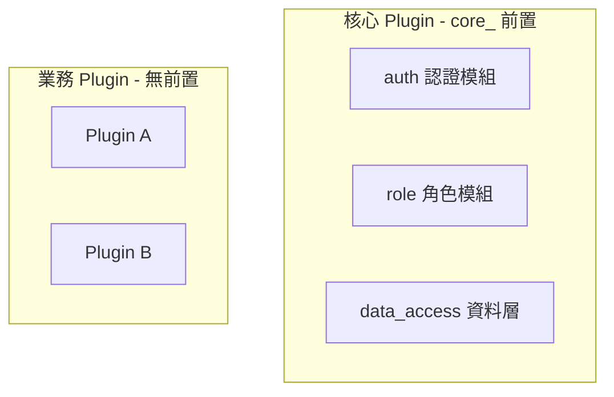

# 命名規範

## 概述

本文件定義專案中程式碼、資料庫欄位、變數等的命名規則，確保風格一致。

---

## 基本原則

### 命名風格

| 項目 | 風格 | 範例 |
|------|------|------|
| 資料庫欄位 | snake_case | `user_id`, `created_at` |
| Model 屬性 | snake_case | `user.email` |
| Method 名稱 | snake_case | `find_by_email` |
| 變數 | snake_case | `current_user` |
| 常數 | SCREAMING_SNAKE_CASE | `MAX_RETRY_COUNT` |
| Class 名稱 | PascalCase | `UserSynchronizer` |
| 檔案名稱 | snake_case | `user_synchronizer.rb` |

---

## 核心元件前置詞

### 規則

**核心 Plugin 提供的欄位與方法使用 `core_` 前置詞**，以區分核心功能與業務功能。

### 適用範圍



### 欄位命名

| 模組 | 欄位 | 說明 |
|------|------|------|
| 認證 | `core_user_id` | 外部身份識別碼 |
| 認證 | `core_provider` | 身份提供者名稱 |
| 認證 | `core_last_login_at` | 最後登入時間 |
| 角色 | `core_role_id` | 角色識別碼 |
| 角色 | `core_assigned_by` | 角色指派者 |
| 角色 | `core_assigned_at` | 角色指派時間 |
| 追蹤 | `core_created_by` | 建立者 |
| 追蹤 | `core_updated_by` | 更新者 |
| 追蹤 | `core_deleted_at` | 軟刪除時間 |

### 方法命名

```ruby
# 核心 Plugin 提供的 Helper
module CorePlugin::Auth::CurrentUserHelper
  def core_user_id          # 核心方法用 core_ 前置
  def core_current_user
  def core_user_signed_in?
end

# 業務 Plugin 的方法
class OrderService
  def create_order          # 業務方法無前置
  def calculate_total
end
```

---

## User Model 欄位分類

```ruby
class User < ApplicationRecord
  # === 核心欄位（core_ 前置）===
  # 由核心 Plugin 定義與維護
  attribute :core_user_id, :string       # 外部 Provider 識別碼（必要）
  attribute :core_provider, :string      # 身份提供者
  attribute :core_status, :string        # 狀態：active, locked, disabled
  attribute :core_locked_at, :datetime   # 鎖定時間
  attribute :core_last_login_at, :datetime
  
  # === 同步欄位（從 Token 同步）===
  # 無前置，但來源是 Token
  attribute :email, :string
  attribute :name, :string
  
  # === 業務欄位（各 Plugin 擴充）===
  # 無前置，由業務 Plugin 定義
  # phone, department, avatar_url...
end
```

---

## 資料庫 Table 命名

### 核心 Plugin 的 Table

| Table | 說明 |
|-------|------|
| `users` | 使用者（核心） |
| `roles` | 角色（Rolify） |
| `users_roles` | 使用者角色關聯 |
| `core_permissions` | 核心權限設定 |
| `core_plugin_subscriptions` | Plugin 訂閱狀態 |

### 業務 Plugin 的 Table

**規則**：以 Plugin 名稱為前置，避免衝突

| Plugin | Table 範例 |
|--------|-----------|
| plugin_a | `plugin_a_orders`, `plugin_a_products` |
| plugin_b | `plugin_b_tickets`, `plugin_b_comments` |

```ruby
# Plugin A 的 Model
module PluginA
  class Order < ApplicationRecord
    self.table_name = 'plugin_a_orders'
  end
end
```

---

## API 回應格式

### Rails 內部：snake_case

```ruby
user.core_user_id   # => "uuid-123"
user.email          # => "test@example.com"
```

### API 回應：可轉換為 camelCase

```ruby
# 若前端需要 camelCase，在 Serializer 轉換
class UserSerializer
  def as_json
    {
      coreUserId: user.core_user_id,
      email: user.email,
      name: user.name
    }
  end
end
```

---

## 設定檔命名

| 類型 | 檔名 | 範例 |
|------|------|------|
| Rails 設定 | snake_case.yml | `database.yml`, `oauth2.yml` |
| 環境變數 | SCREAMING_SNAKE_CASE | `DATABASE_URL`, `OAUTH2_ISSUER` |

---

## 相關文件

- [文件撰寫規範](writing-guide.md) - 文件格式規範
- [Core Plugin 開發指南](core-plugin/core-plugin-guide.md) - 核心模組說明
