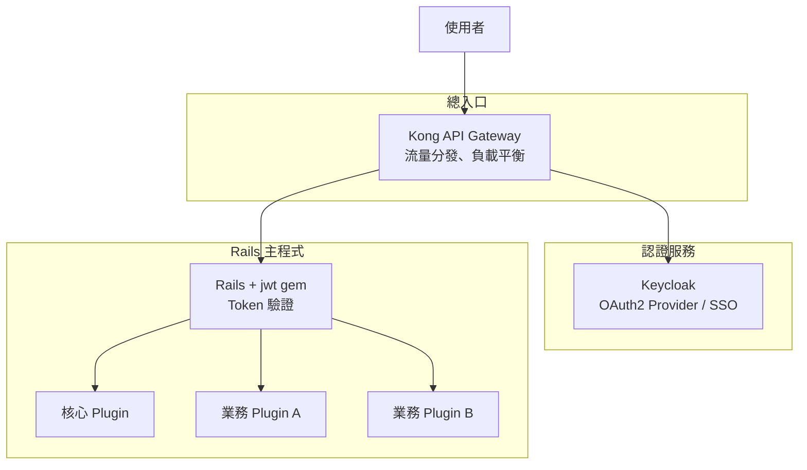
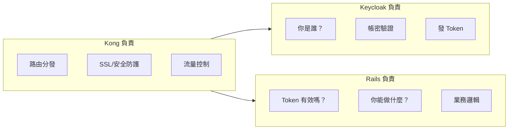
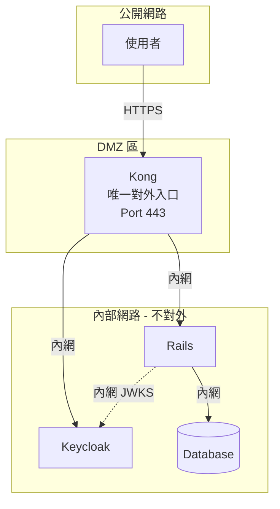
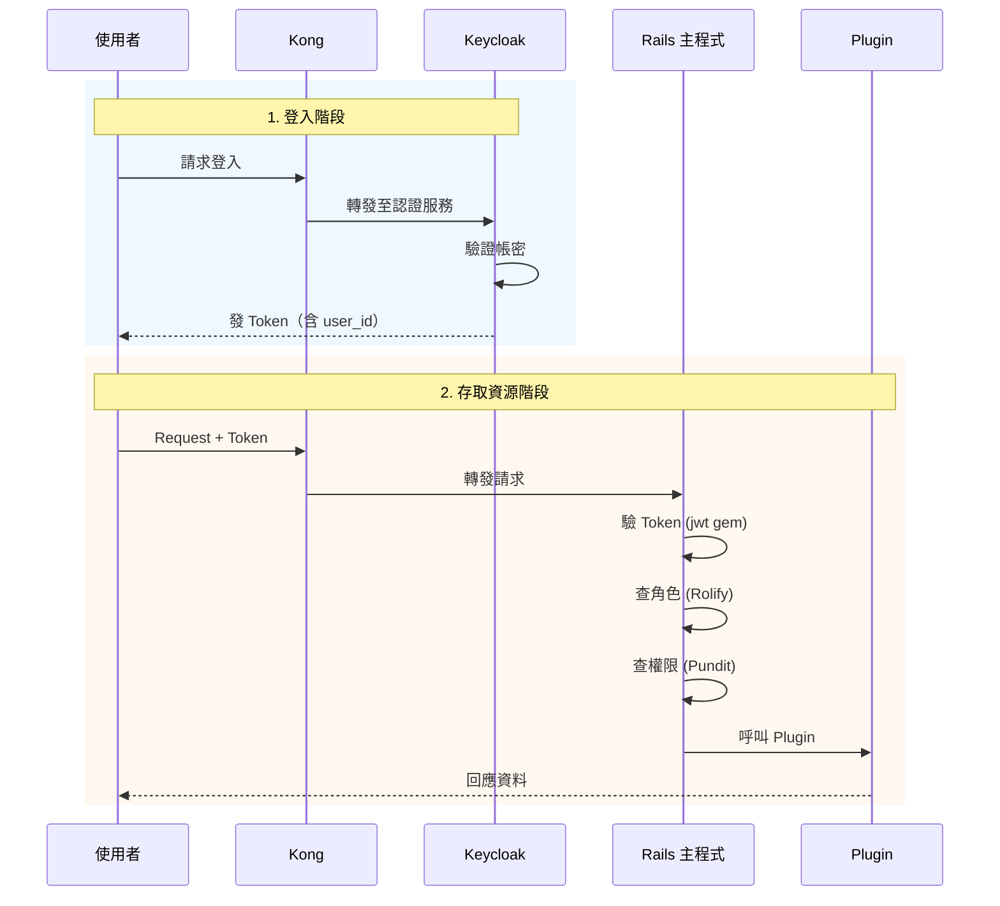
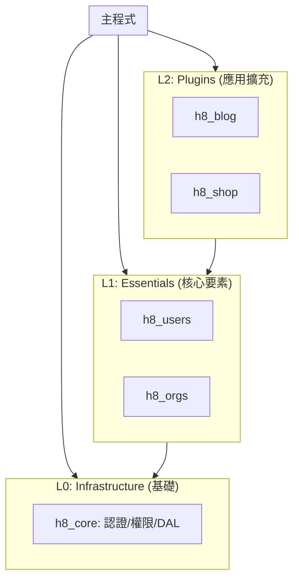
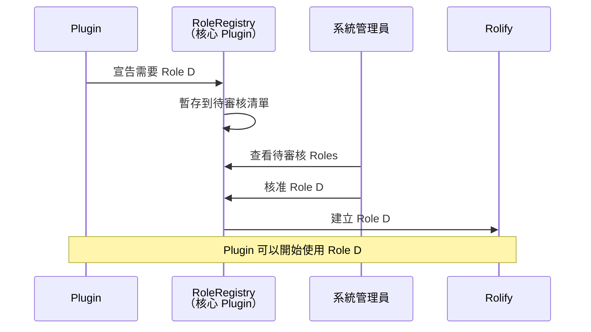
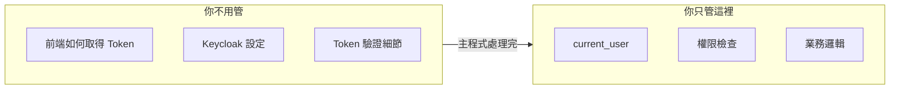

# 專案規格書

## 專案資訊

- **專案名稱**：h8（暫定）
- **建立日期**：2026-01-20
- **專案性質**：大型應用生態系

---

## 專案目標

建立一個**開放式 Rails 生態系**，類似 Redmine / WordPress 的 Plugin 架構，讓各廠商可以基於統一框架開發應用模組。

### 核心理念

- **統一入口**：所有認證、權限由主程式管控
- **模組化設計**：功能以 Plugin 形式開發，可插拔

---

## 系統架構

### 架構圖



### 技術選型

| 項目 | 選擇 | 說明 |
|------|------|------|
| 總入口 | Kong | API Gateway、負載平衡、流量控制 |
| 認證服務 | Keycloak | OAuth2 Provider、SSO、多系統統一登入 |
| 後端框架 | Ruby on Rails | 主程式 + Plugin (Engine/Gem) 機制 |
| Token 驗證 | jwt gem | 驗證 Keycloak 發出的 JWT Token |
| 角色管理 | Rolify | 定義使用者角色 |
| 權限管理 | Pundit | 定義資源存取權限 (Policy) |
| 前端 | Hotwire (Turbo + Stimulus) | SPA + PWA，不依賴複雜前端框架 |
| 部署 | Docker Container + Kamal | 標準化部署 |
| 資料庫 | ActiveRecord ORM | 支援 PostgreSQL / MySQL / Oracle |

### 元件職責分工

| 元件 | 職責 | 不負責 |
|------|------|--------|
| **Kong** | 唯一對外入口、路由分發、SSL 終止、流量控制、安全防護 | 業務邏輯、身份驗證 |
| **Keycloak** | 身份驗證（帳密）、發放 JWT Token、使用者註冊、SSO | 業務邏輯、權限管理 |
| **Rails** | 驗證 Token 簽章、角色管理、權限控制、業務邏輯 | 儲存密碼、發放 Token |



### 網路安全架構

**原則：Kong 為唯一對外入口，Keycloak 與 Rails 不直接暴露於公開網路。**



| 區域 | 對外暴露 | 元件 |
|------|---------|------|
| DMZ | ✅ Port 443 | Kong |
| 內部網路 | ❌ 不對外 | Keycloak、Rails、Database |

#### 安全考量

| 項目 | 說明 |
|------|------|
| 減少攻擊面 | 僅 Kong 暴露，攻擊者無法直接存取內部服務 |
| 統一防護 | WAF、Rate Limiting 集中於 Kong |
| 隱藏結構 | 外部無法得知後端技術棧 |
| 集中監控 | 所有流量經過 Kong，便於日誌與異常偵測 |

### Kong 路由規則

| 路徑模式 | 轉發目標 | 說明 |
|---------|---------|------|
| `/auth/*` | Keycloak | 登入、註冊、Token 相關 |
| `/api/*` | Rails | 業務 API |
| `/*` | Rails | Web 頁面 |

---

## 身份與權限架構

### 職責分工

| 項目 | 負責單位 | 儲存位置 |
|------|---------|---------|
| **身份**（你是誰） | Keycloak | Keycloak DB |
| **角色**（你是什麼身份） | Rails 主程式 (Rolify) | Rails DB |
| **權限**（你能做什麼） | Rails 主程式 (Pundit) | Rails 程式碼 (Policy) |

### 認證流程



---

## Plugin 架構

### 設計原則

- 基於 **Rails Engine/Gem 原生規範**
- 加上主程式對**認證、權限、資料存取**的統一管控
- 形成**開放式 Rails 生態系**

### Plugin 層級圖



### Plugin 分類

| 層級 | 類型 | 說明 | 範例 | 可否移除 | 維護者 |
|:---:|:---|:-----|:-----|:---:|:---:|
| **L0** | Infrastructure | 基礎設施，與業務無關的底層與共用介面 | `h8_core` | ❌ | 核心團隊 |
| **L1** | Essentials | 核心要素，系統運作不可或缺的通用業務 | `h8_users`, `h8_orgs` | ❌ | 核心團隊 |
| **L2** | Plugins | 應用擴充，針對特定領域的垂直業務功能 | `h8_blog`, `h8_shop` | ✅ | 各廠商/社群 |

### Plugin 限制

| 項目 | 規則 |
|------|------|
| 認證 | 由主程式統一管理，Plugin 不能自建 |
| 角色 | 只能在主程式定義，Plugin 可宣告需求由管理員核准 |
| 權限 | 由主程式設定，Plugin 需寫 Policy 供設定 |
| 資料存取 | 只能讀自己建立的 Table，或透過資料存取層取得共用資料 |

### 角色註冊機制

Plugin 可透過宣告式方式申請新角色，由系統管理員決定是否核准。



#### Plugin 宣告範例

```ruby
# my_plugin/lib/my_plugin/engine.rb
module MyPlugin
  class Engine < ::Rails::Engine
    
    initializer 'my_plugin.register_roles' do
      RoleRegistry.register do |r|
        r.role :plugin_d_admin, 
               display_name: 'D 管理員',
               description: '可執行 Plugin D 的管理功能',
               inherits_from: [:member]
      end
    end
    
  end
end
```

#### 設計優點

| 優點 | 說明 |
|------|------|
| Plugin 可自主宣告 | 不用人工申請流程 |
| 主程式保有控制權 | 管理員決定是否啟用 |
| 自動化 | 安裝 Plugin 時自動註冊 |
| 可追溯 | 知道每個 Role 來自哪個 Plugin |

### Plugin 開發者視角



```ruby
# Plugin 不用管認證細節，只需使用主程式提供的介面
class MyPluginController < ApplicationController
  def index
    current_user        # 已登入的使用者（主程式提供）
    current_user.roles  # 角色列表（Rolify 提供）
    
    authorize @resource # 權限檢查（Pundit 提供）
  end
end
```

**關鍵理解**：
> 有合法 Token = 有 current_user = 可以開始做事

---

## 目錄結構

| 目錄 | 用途 |
|------|------|
| `/code` | 程式碼 |
| `/docs` | 文件 |
